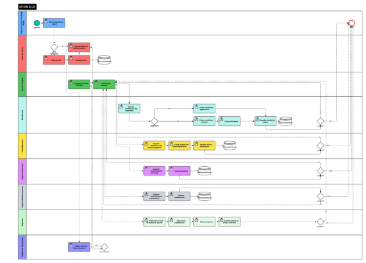
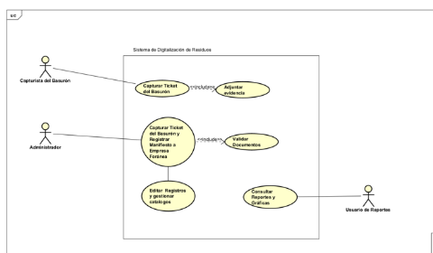
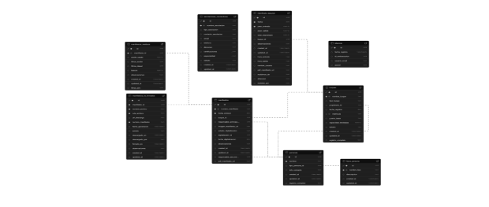



**Instituto Tecnológico Superior de Puerto Peñasco**

**PROYECTO INTEGRADOR**

DCK - Plataforma Web de Gestión de Residuos Marítimos

**Ingeniería en Sistemas Computacionales**

6to Semestre

**Maestros:**

Lopez Chaco Diana Elizabeth

Osuna Talamantes Daniel Alonso

**Materias integradoras:**

Administración de Bases de Datos

Ingenieria de Software

**Integrantes:**

Quintero Aldana Jesús Manuel

Sabori Fernández Miguel Rogelio

Suárez Gutiérrez Luis Mario

Zamudio Martín Alexa Merary

Puerto Peñasco, Sonora a 20 de Mayo del 2026

**Tabla de contenido**

[***1. Planteamiento del problema	***3******](#_toc230548452)

[**1.1 Introducción del proyecto	**3****](#_toc230548453)

[**1.2 Datos de la empresa	**4****](#_toc230548454)

[**1.3 Problemática	**4****](#_toc230548455)

[**1.4 Objetivo general	**5****](#_toc230548456)

[Objetivos específicos	5](#_toc230548457)

[**1.5 Justificación	**6****](#_toc230548458)

[**1.6 Descripción de actividades por integrante de equipo	**7****](#_toc230548459)

[***2. Análisis del proyecto	***8******](#_toc230548460)

[**2.1 Descripción de la fase de análisis	**8****](#_toc230548461)

[Requerimientos funcionales identificados	8](#_toc230548462)

[Requerimientos no funcionales identificados	9](#_toc230548463)

[**2.2 Descripción de los instrumentos aplicados	**10****](#_toc230548464)

[***3. Diseño	***11******](#_toc230548465)

[**3.1 Descripción de la fase de diseño	**11****](#_toc230548466)

[Filosofía visual: Glassmorphism Refinado	11](#_toc230548467)

[**3.2 Selección de colores, plantillas, logos y eslogan	**12****](#_toc230548468)

[Paleta de colores	12](#_toc230548469)

[Tipografía	12](#_toc230548470)

[Logos e identidad gráfica	13](#_toc230548471)

[Eslogan del sistema	13](#_toc230548472)

[**3.3 Elección de la arquitectura del software	**13****](#_toc230548473)

[Arquitectura cliente-servidor	13](#_toc230548474)

[***4. Desarrollo del proyecto	***15******](#_toc230548475)

[**4.1 Justificación de las tecnologías utilizadas	**15****](#_toc230548476)

[Frontend	15](#_toc230548477)

[Backend / Base de Datos	15](#_toc230548478)

[Generación de documentos y reportes	16](#_toc230548479)

[Gráficos y visualización	16](#_toc230548480)

[Herramientas de desarrollo	16](#_toc230548481)

[**4.2 Presentación de la aplicación	**16****](#_toc230548482)

[Landing Page pública	16](#_toc230548483)

[Panel de Login	17](#_toc230548484)

[Dashboard Home	17](#_toc230548485)

[Módulo: Manifiestos de Barco	17](#_toc230548486)

[Módulo: Recibo del Basurón Municipal	17](#_toc230548487)

[Módulo: Estadísticas y Reportes	17](#_toc230548488)

[Módulos CRUD de catálogos	18](#_toc230548489)

[Módulo: Configuraciones	18](#_toc230548490)

[**4.3 Base de Datos	**18****](#_toc230548491)

[Modelo de la base de datos	18](#_toc230548492)

[Diccionario de datos	18](#_toc230548493)

[Buckets de Supabase Storage	21](#_toc230548494)

[**4.4 Tipos de Usuarios y descripción de restricciones	**22****](#_toc230548495)

[Restricciones de seguridad a nivel de base de datos	22](#_toc230548496)

[**4.5 Presupuesto	**23****](#_toc230548497)

[Costos de desarrollo (proyecto académico)	23](#_toc230548498)

[Costos referenciales de mercado	23](#_toc230548499)

[Costos anuales de operación e infraestructura	23](#_toc230548500)

[**4.6 Redes y descripción de hardware necesario	**24****](#_toc230548501)

[Arquitectura de red	24](#_toc230548502)

[Hardware mínimo recomendado en el cliente	25](#_toc230548503)

[Plataformas y servidores utilizados	25](#_toc230548504)

[Recomendaciones de hardware para el centro de acopio	25](#_toc230548505)

[***5. Implementación (avance)	***26******](#_toc230548506)

[**5.1 Estado actual de la fase de implementación	**26****](#_toc230548507)

[**5.2 Pruebas realizadas (avance)	**26****](#_toc230548508)

[**5.3 Publicación del sistema	**27****](#_toc230548509)

[***Anexos	***28******](#_toc230548510)

[**Anexo A. Instrumento de entrevista aplicada	**28****](#_toc230548511)

[**Anexo B. Primeros bocetos y mockups del sistema	**30****](#_toc230548512)

[**Anexo C. Diagramas BPMN, casos de uso y base de datos	**31****](#_toc230548513)

[Diagrama BPMN del proceso completo	31](#_toc230548514)

[Diagrama de Casos de Uso	31](#_toc230548515)

[Diagrama del modelo de base de datos	32](#_toc230548516)

[**Anexo D. Manuales	**33****](#_toc230548517)

[Manual de usuario (avance de contenido)	33](#_toc230548518)

[Manual técnico (avance de contenido)	33](#_toc230548519)

[Manual de instalación y configuración (avance de contenido)	33](#_toc230548520)

# **1. Planteamiento del problema**
## **1.1 Introducción del proyecto**
El presente documento describe el desarrollo y la evolución del Sistema DCK, una plataforma web full-stack creada para digitalizar por completo la gestión de residuos generados por las embarcaciones pesqueras de Puerto Peñasco, Sonora. El proyecto fue iniciado durante el semestre anterior como parte del Proyecto Integrador de 5° semestre de la carrera de Ingeniería en Sistemas Computacionales, y en este 6° semestre se da continuidad al mismo bajo las materias de Administración de Bases de Datos, Desarrollo de Aplicaciones Web y Redes de Computadoras.

La plataforma reemplaza por completo el proceso manual basado en formatos físicos, tickets en papel y archiveros que la organización DCK venía utilizando desde 2014. En esta nueva fase, el proyecto se ha migrado del stack original (Astro, Golang y PostgreSQL local) a un stack más moderno y mantenible: Next.js 16, React 19, TypeScript y Supabase. Además, se han incorporado nuevos módulos clave: una landing page pública con estadísticas en tiempo real, un sistema de respaldos profesional, gestión configurable del tamaño de letra para accesibilidad, internacionalización español/inglés y un módulo de configuraciones completo.

El sistema permite registrar manifiestos de barcos, recibos del basurón municipal, firmas digitales, generación automática de PDFs oficiales, panel de estadísticas con KPIs comparativos por período y un módulo público que comunica el impacto ambiental acumulado de la organización al ciudadano y a las autoridades. Toda la información se almacena en una base de datos relacional alojada en Supabase, con Storage para evidencias fotográficas y PDFs, y políticas de Row Level Security para garantizar la integridad y la seguridad de los datos.
## **1.2 Datos de la empresa**
Nombre: DCK.

Fundador: Sr. Francisco Javier Bojórquez Ochoa.

Ubicación: Puerto Peñasco, Sonora, México (Centro de Acopio del Puerto).

Sector: Organización ambiental dedicada al manejo responsable de residuos generados por la flota pesquera local.

Origen del nombre: El nombre DCK proviene de las iniciales de las tres hijas del fundador. La iniciativa fue creada como un esfuerzo personal y comunitario para promover la conciencia ambiental dentro de la comunidad pesquera de Puerto Peñasco, especialmente en lo referente al control de los residuos generados por las embarcaciones.

Colaboración institucional: DCK no es una empresa grande, pero su impacto en el puerto es significativo, ya que funge como un punto clave entre la comunidad pesquera y las autoridades ambientales, principalmente SEMARNAT (Secretaría de Medio Ambiente y Recursos Naturales) y SEMAR (Secretaría de Marina). DCK opera además en coordinación con la Reserva de la Biósfera del Alto Golfo de California, zona de altísima biodiversidad marina.

Actividad principal: Recepción, clasificación, registro y disposición final de residuos como aceite usado, filtros de aceite, filtros de diésel, filtros de aire y basura general que llegan al centro de acopio desde las embarcaciones pesqueras del puerto, así como la entrega controlada de dichos residuos al relleno sanitario municipal o a empresas externas autorizadas para su tratamiento.
## **1.3 Problemática**
Aunque la primera versión del Sistema DCK fue entregada el semestre pasado y resolvió en gran medida el problema de los registros en papel, durante el periodo de operación y la entrevista de seguimiento aplicada al responsable surgieron varias necesidades nuevas que motivaron este segundo desarrollo:

- **Stack tecnológico difícil de mantener.** La versión anterior estaba construida con Astro + React embebido en el frontend y Golang con GoFiber en el backend, orquestado por Docker. Esta arquitectura, aunque funcional, dificultaba el mantenimiento por parte de un equipo nuevo, ya que requería conocimiento especializado de dos lenguajes distintos y de la orquestación contenedorizada.
- **Falta de un módulo público de impacto.** El sistema anterior se limitaba al panel administrativo. No existía un canal por el cual la comunidad, las autoridades o los propios pescadores pudieran ver de forma directa el trabajo y el impacto ambiental acumulado del centro de acopio.
- **Necesidad de mejor accesibilidad.** El usuario final principal es una persona adulta mayor con problemas visuales y poca experiencia tecnológica. La interfaz original tenía elementos suficientes, pero requería más opciones de personalización (tamaño de letra global, modo oscuro siempre activo, contrastes más altos).
- **Ausencia de un sistema profesional de respaldos.** En la versión anterior no existía una herramienta que permitiera generar respaldos manuales en formatos legibles (JSON/CSV), con recordatorios configurables y trazabilidad por fecha.
- **Falta de internacionalización.** Aunque la plataforma se usa localmente, ciertos reportes o demostraciones requieren versión bilingüe para autoridades federales o cooperaciones internacionales (MARPOL, ONU ODS 14).
- **Trazabilidad de manifiestos a basurón.** Faltaba consolidar dentro de un mismo sistema el flujo completo del residuo: desde que se recibe en el centro de acopio (manifiesto del barco) hasta que se entrega en el basurón municipal (recibo del basurón). Esta trazabilidad era débil porque cada documento vivía aislado.

La problemática actual se centra entonces en evolucionar la plataforma existente para resolver estas carencias, manteniendo intacta toda la información histórica ya digitalizada (más de 5,000 registros desde 2014) y mejorando la experiencia diaria del operador del centro de acopio.
## **1.4 Objetivo general**
Rediseñar e implementar la plataforma web del Sistema DCK utilizando un stack moderno y mantenible (Next.js 16 + Supabase + TypeScript), incorporando módulos nuevos de landing pública con estadísticas reales, sistema de respaldos JSON/CSV, configuraciones de accesibilidad e internacionalización español/inglés, sin perder funcionalidad respecto a la versión anterior y manteniendo la integridad de los datos históricos del centro de acopio.
### **Objetivos específicos**
1. Migrar el stack del sistema desde Astro + Golang hacia Next.js 16 + React 19 + TypeScript, conservando la estructura de la base de datos y agregando las nuevas tablas necesarias.
1. Implementar una landing page pública con identidad cinematográfica que comunique el impacto ambiental acumulado mediante estadísticas calculadas en tiempo real desde Supabase.
1. Desarrollar un sistema completo de respaldos descargables en formato JSON y CSV, con filtros por rango de fechas, inclusión opcional del índice de archivos y recordatorios configurables.
1. Incorporar configuración global de accesibilidad: modo oscuro/claro persistente, cuatro tamaños de letra globales y soporte completo para internacionalización (español/inglés).
1. Mantener y mejorar el módulo de manifiestos de barco con firma digital basada en canvas y generación automática de PDFs mediante jsPDF + html2canvas.
1. Mantener y mejorar el módulo de recibos del basurón municipal con cálculo automático de peso depositado y carga de comprobantes fotográficos.
1. Implementar un panel de estadísticas con KPIs comparativos por período (semana / mes / trimestre / año / personalizado) y exportación a CSV.
1. Documentar técnicamente el sistema y elaborar los manuales de usuario, técnico y de instalación necesarios para la entrega final.
## **1.5 Justificación**
La continuidad y modernización del Sistema DCK se justifica desde tres planos: ambiental, tecnológico y comunitario.

Desde la perspectiva ambiental, Puerto Peñasco se encuentra en el Alto Golfo de California, una de las zonas con mayor biodiversidad marina del mundo y hogar de la vaquita marina, una especie en peligro crítico de extinción. El manejo correcto de los residuos de las embarcaciones pesqueras es una pieza fundamental para reducir la contaminación del ecosistema marino. Un litro de aceite usado puede contaminar hasta un millón de litros de agua. Digitalizar y dar trazabilidad a estos residuos no es solo un asunto administrativo: es un compromiso ambiental que se alinea con el convenio MARPOL Anexo V, con la Ley General para la Prevención y Gestión Integral de los Residuos (LGPGIR) de México, con la NOM-001-SEMARNAT-2021 y con el Objetivo de Desarrollo Sostenible 14.1 de la ONU.

Desde la perspectiva tecnológica, el cambio de stack hacia Next.js + Supabase reduce significativamente los costos de mantenimiento del sistema y permite que un equipo de desarrollo más pequeño pueda seguir evolucionando la plataforma. Supabase, al ser un BaaS (Backend as a Service), ofrece base de datos PostgreSQL administrada, autenticación, almacenamiento, Edge Functions y políticas de Row Level Security listas para usar, eliminando la necesidad de mantener un backend personalizado en Go. Esto libera tiempo del equipo para enfocarse en la lógica de negocio y la experiencia de usuario.

Desde la perspectiva comunitaria, la incorporación de una landing page pública con estadísticas reales permite que tanto la ciudadanía como las autoridades puedan visualizar el impacto acumulado del trabajo de DCK. La organización gana visibilidad y respaldo social, y se fortalece la cultura ambiental del puerto. Adicionalmente, las mejoras en accesibilidad garantizan que el operador del centro de acopio, una persona adulta mayor, pueda seguir utilizando el sistema sin barreras.

Finalmente, el proyecto es viable porque se construye sobre la base ya validada del semestre pasado, lo cual reduce el riesgo y aprovecha el conocimiento adquirido por el equipo durante el desarrollo anterior.
## **1.6 Descripción de actividades por integrante de equipo**

|**Integrante**|**Actividades asignadas**|
| :-: | :-: |
|**Quintero Aldana Jesús Manuel**|Diseño y desarrollo del módulo de Manifiestos de Barco (creación, edición, firma digital, generación de PDF). Implementación del componente SignaturePad basado en canvas HTML5. Integración con Supabase Storage para imágenes de evidencia. Documentación técnica del módulo.|
|**Sabori Fernández Miguel Rogelio**|Desarrollo del módulo de Estadísticas y Reportes con Recharts. Implementación de los KPIs con comparación por período, gráficas de barras, líneas y áreas. Exportación a CSV. Apoyo en el módulo de Recibos del Basurón municipal y cálculo automático de peso depositado.|
|**Suárez Gutiérrez Luis Mario**|Arquitectura general del proyecto, configuración inicial del stack (Next.js 16, TypeScript, Tailwind 4, next-intl). Diseño y desarrollo de la Landing Page cinematográfica con estadísticas en tiempo real. Implementación del sistema de respaldos JSON/CSV con recordatorios configurables. Configuración de internacionalización (español/inglés). Coordinación general del repositorio.|
|**Zamudio Martín Alexa Merary**|Desarrollo de los módulos CRUD de Personas, Embarcaciones y Asociaciones Recolectoras. Implementación del módulo de Configuraciones (perfil, apariencia, tamaño de letra global). Diseño visual del sistema, paleta de colores, componentes UI reutilizables (botones, modales, tarjetas, tablas). Aplicación de la entrevista al usuario final.|

*Tabla 1. Distribución de actividades por integrante del equipo.*

# **2. Análisis del proyecto**
## **2.1 Descripción de la fase de análisis**
La fase de análisis del proyecto consistió en estudiar a fondo el sistema existente entregado el semestre pasado, identificar sus puntos fuertes y débiles, y determinar las nuevas funcionalidades requeridas por la organización DCK y por su usuario final. Esta fase se apoyó en tres fuentes principales de información: la entrevista directa con el responsable del centro de acopio, la revisión del código fuente y la documentación entregada anteriormente, y la observación del flujo real de trabajo en el centro de acopio durante las visitas realizadas.

La investigación fue principalmente de tipo cualitativo. No se buscaba acumular cifras estadísticas, sino comprender de primera mano cómo se trabajaba con el sistema anterior, qué partes resultaban incómodas para el usuario, qué información se generaba con frecuencia y qué reportes hacían falta. Este enfoque permitió descubrir necesidades que no aparecían en la documentación técnica, como la dificultad del usuario para leer letras pequeñas en pantalla bajo la luz del puerto, o la necesidad de tener una vista pública que mostrara el trabajo de la organización a la comunidad.

Como técnicas complementarias, se realizó análisis documental de los manifiestos físicos archivados desde 2014, lo que permitió mapear con precisión qué campos eran obligatorios, cuáles eran opcionales y qué información se repetía con frecuencia. Esto sirvió para validar que la estructura de la base de datos no requería cambios mayores, sino más bien adiciones puntuales (tablas de soporte para asociaciones recolectoras y bitácora de operaciones).

Resultado de esta fase fue un documento de requerimientos funcionales y no funcionales, un diagrama BPMN actualizado del proceso completo y la lista de casos de uso del sistema. Estos artefactos sirvieron de insumo directo para la fase de diseño.
### **Requerimientos funcionales identificados**
- **RF-01.** El sistema debe permitir el registro digital de manifiestos de barco, incluyendo datos de la embarcación, fecha de emisión, cantidades de cada tipo de residuo (aceite usado, filtros de aceite, diésel y aire, basura general) y responsables involucrados.
- **RF-02.** El sistema debe permitir el registro digital de los recibos del basurón municipal, incluyendo número de ticket, pesos de entrada y salida, hora de ingreso y egreso, y cálculo automático del total depositado.
- **RF-03.** El sistema debe generar de forma automática un número único de manifiesto con el formato MAN{ddmmyyyy} {NNN}, donde el secuencial se reinicia por día.
- **RF-04.** El sistema debe permitir capturar firmas digitales en un canvas (mouse o táctil) con hasta cuatro firmantes por manifiesto: motorista, cocinero, oficial y responsable de líquidos.
- **RF-05.** El sistema debe generar PDFs oficiales de cada manifiesto y de cada recibo del basurón, subirlos automáticamente al bucket correspondiente en Supabase Storage y permitir su descarga posterior.
- **RF-06.** El sistema debe ofrecer un panel de estadísticas con KPIs comparativos entre periodos (semana, mes, trimestre, año, todo, personalizado) y gráficas dinámicas (barras, líneas, áreas).
- **RF-07.** El sistema debe permitir la exportación de reportes detallados a CSV con filtros por embarcación, fecha y estado del manifiesto.
- **RF-08.** El sistema debe contar con módulos CRUD completos para Personas, Embarcaciones y Asociaciones Recolectoras, con paginación, búsqueda y filtros.
- **RF-09.** El sistema debe ofrecer una landing page pública con estadísticas en tiempo real calculadas desde la base de datos, incluyendo total de manifiestos, toneladas de residuos y embarcaciones activas.
- **RF-10.** El sistema debe contar con un módulo de respaldos que permita descargar la información en JSON o CSV, con rango configurable (siempre, última semana, último mes, último año) y opción de incluir el índice de archivos del Storage.
- **RF-11.** El sistema debe ofrecer recordatorios configurables de respaldo (semanal, quincenal, mensual o desactivado) y mostrar un banner de alerta cuando el umbral haya sido superado.
- **RF-12.** El sistema debe contar con autenticación basada en correo y contraseña, con verificación por código OTP y flujo de recuperación de contraseña.
- **RF-13.** El sistema debe cerrar sesión de manera automática tras treinta minutos de inactividad del usuario.
### **Requerimientos no funcionales identificados**
- **RNF-01. Accesibilidad.** El sistema debe ofrecer modo oscuro y modo claro intercambiables, tamaño de letra configurable en cuatro niveles (14, 16, 18 y 20 px) y elementos visuales suficientemente grandes y contrastados para usuarios con dificultades visuales.
- **RNF-02. Internacionalización.** La interfaz debe estar disponible en español e inglés, con detección del idioma a partir del primer segmento de la URL.
- **RNF-03. Rendimiento.** Las páginas deben cargar en menos de tres segundos con conexión doméstica promedio, y las gráficas deben renderizarse en menos de un segundo tras filtrar.
- **RNF-04. Seguridad.** Todas las operaciones de escritura deben requerir autenticación válida y estar protegidas por políticas RLS de Supabase a nivel de fila.
- **RNF-05. Mantenibilidad.** El código debe estar tipado con TypeScript en su totalidad, debe seguir reglas de ESLint y debe estar organizado en una estructura modular de carpetas que separe app, components, lib y types.
- **RNF-06. Disponibilidad.** El sistema debe ofrecer un mecanismo de respaldos manuales y descargables, sin depender de un servidor adicional, para garantizar que los datos puedan recuperarse en caso de incidencia con Supabase.
- **RNF-07. Compatibilidad.** El sistema debe ser totalmente responsivo y funcionar correctamente en navegadores modernos (Chrome, Firefox, Edge, Safari) y en dispositivos móviles iOS y Android.
- **RNF-08. Persistencia de preferencias.** Las preferencias del usuario (tema, tamaño de letra, locale) deben persistir entre sesiones utilizando localStorage.
## **2.2 Descripción de los instrumentos aplicados**
Para la fase de análisis del semestre actual se aplicó un único instrumento principal: una entrevista semiestructurada al responsable del centro de acopio, el señor Francisco Javier Bojórquez Ochoa. Se eligió este instrumento porque el usuario final es una sola persona y porque el conocimiento que esta persona posee del proceso real solo puede obtenerse mediante diálogo directo.

La entrevista se llevó a cabo en dos sesiones, ambas en el propio centro de acopio. En la primera sesión se obtuvo información sobre el uso real del sistema entregado el semestre pasado: qué funcionalidades usaba con mayor frecuencia, qué partes le resultaban incómodas, qué errores había detectado y qué mejoras le gustaría ver. En la segunda sesión se profundizó sobre las nuevas funcionalidades propuestas (landing pública, respaldos, accesibilidad) y se obtuvo su validación.

Se utilizó un guion semiestructurado que permitía formular preguntas concretas pero también dejar espacio para que el entrevistado se extendiera en los puntos que considerara relevantes. Las respuestas fueron transcritas literalmente y posteriormente analizadas en grupo por los integrantes del equipo para extraer los requerimientos. El instrumento completo se incluye en el Anexo A del presente documento.

Como instrumentos secundarios se utilizaron la observación directa del flujo de trabajo en el centro de acopio durante dos visitas, y el análisis documental de los manifiestos físicos archivados, lo que permitió validar que la estructura propuesta de base de datos efectivamente cubría todos los campos requeridos por el proceso real.

# **3. Diseño**
## **3.1 Descripción de la fase de diseño**
La fase de diseño del Sistema DCK fue dirigida en todo momento por dos principios: accesibilidad real para el usuario final y mantenibilidad del código para el equipo de desarrollo. El usuario final del sistema es una persona adulta mayor, con problemas visuales y poca familiaridad con tecnologías digitales, por lo que la interfaz debía ser limpia, guiada, con elementos grandes y de alta legibilidad. Por otro lado, dado que el proyecto sería entregado a la organización DCK como su sistema operativo activo, el código debía ser fácil de mantener por equipos futuros.

El proceso se desarrolló en tres etapas: bocetado a mano y mockups simples, definición de un design system con paleta de colores, tipografía y componentes reutilizables, y finalmente implementación visual de cada módulo siguiendo el sistema definido. Aunque no se utilizó Figma como herramienta principal, sí se realizaron prototipos de baja fidelidad para validar los flujos principales antes de pasar a código. Los primeros bocetos pueden consultarse en el Anexo B.
### **Filosofía visual: Glassmorphism Refinado**
Se decidió adoptar el concepto de Glassmorphism Refinado como guía visual del sistema. Este estilo combina transparencias controladas, desenfoque contextual y gradientes sutiles, lo que produce una interfaz limpia, profesional y moderna, apropiada para una plataforma vinculada con SEMARNAT y el gobierno federal. A diferencia del Glassmorphism más agresivo de plataformas gráficas, en DCK se aplica con moderación para no sacrificar legibilidad.

Las decisiones específicas tomadas durante la fase de diseño fueron las siguientes:

- **Elementos grandes y de alto contraste.** Botones amplios, iconos reconocibles, textos grandes y separados, paletas con contrastes altos en ambos modos (claro y oscuro).
- **Sidebar como columna principal de navegación.** El menú lateral fue diseñado con iconos grandes, etiquetas siempre acompañadas de texto, secciones agrupadas (Principal, Externos, Sistema) y opción de colapsarlo solo si el usuario lo desea explícitamente.
- **Distribución limpia.** Cada pantalla tiene un único objetivo y evita saturación visual.
- **Modo oscuro como predeterminado.** Se eligió iniciar la app con modo oscuro porque reduce el esfuerzo visual del usuario en condiciones de luz fuerte propias del puerto.
- **Flujos lineales y guiados.** Las acciones complejas (como registrar un manifiesto) se desglosan en pasos secuenciales claros para evitar que el usuario salte entre pantallas o se pierda.
- **Botones de acción principales siempre visibles.** El botón primario de cada pantalla está siempre destacado por tamaño, color e iconografía.
- **Formularios cortos y sin distractores.** Solo se muestran los campos estrictamente necesarios en cada paso.
- **PDF final imita el documento oficial.** El PDF generado se diseñó para que se parezca al manifiesto en papel oficial, facilitando auditorías y validación por parte de las autoridades.
## **3.2 Selección de colores, plantillas, logos y eslogan**
### **Paleta de colores**
Se utilizó como base la paleta Tailwind y se definieron roles claros para cada color, de modo que el sistema fuera coherente entre módulos:

|**Categoría**|**Color**|**Uso**|
| :-: | :-: | :-: |
|**Azul primario**|#3b82f6 (blue-500)|Botones principales, links, estados activos|
|Azul hover|#2563eb (blue-600)|Hover en botones y links|
|Azul profundo|#1d4ed8 (blue-700)|Estados active y focus|
|Teal acento|#14b8a6 (teal-500)|Gradientes decorativos y equivalencias verdes|
|Emerald éxito|#10b981 (emerald-500)|Confirmaciones y estados listo|
|Rojo error|#ef4444 (red-500)|Errores y operaciones de eliminación|
|Amber advertencia|#f59e0b (amber-500)|Alertas y recordatorios|
|Gris oscuro (texto)|#111827 (gray-900)|Encabezados en modo claro|
|Gris claro|#f9fafb (gray-50)|Fondos de secciones y hover|

*Tabla 2. Paleta de colores del Sistema DCK.*
### **Tipografía**
Se eligió la familia Geist Sans (Google Fonts) como fuente principal del sistema, importada desde el layout global de la aplicación. Para fragmentos de código se utiliza Geist Mono. Como fallback se definieron Arial, Helvetica y la pila sans-serif del navegador. La jerarquía tipográfica establecida es:

- **Títulos de página:** text-3xl font-bold a text-4xl font-black.
- **Subtítulos de sección:** text-lg font-bold.
- **Labels de campos:** text-xs font-semibold uppercase tracking-wider.
- **Cuerpo de texto:** text-sm o text-base.
- **Metadatos secundarios:** text-xs text-gray-500.
### **Logos e identidad gráfica**
La identidad visual del sistema combina tres elementos institucionales: el logotipo oficial de DCK (en versiones color y monocromo, claro y oscuro), el logotipo del Instituto Tecnológico Superior de Puerto Peñasco (ITSPP) y el escudo del centro de acopio. Estos elementos se utilizan tanto en la landing pública (de forma cinematográfica con superposiciones suaves) como en el dashboard interno (de forma compacta en el sidebar).
### **Eslogan del sistema**
El eslogan utilizado en la landing pública es: "Conciencia y Cultura para un Mar de Cortés más limpio". Este eslogan resume el doble propósito de la organización: generar conciencia ambiental y promover una cultura del manejo responsable de los residuos en la comunidad pesquera. El eslogan aparece en el hero principal de la landing y se acompaña visualmente con imágenes reales del puerto y de las actividades de recolección.
## **3.3 Elección de la arquitectura del software**
Para garantizar escalabilidad, mantenibilidad y un buen rendimiento, se eligió una arquitectura basada en una aplicación web monolítica con el patrón fullstack en un único framework: Next.js 16 con App Router. Esta decisión se tomó por varias razones técnicas concretas:

- **Un solo lenguaje y un solo framework.** Toda la lógica del proyecto, tanto frontend como cualquier lógica de servidor adicional, vive dentro del mismo proyecto Next.js. Esto reduce la complejidad operacional y la curva de aprendizaje para futuros desarrolladores.
- **Server Components y Client Components.** El App Router de Next.js permite mezclar componentes que se renderizan en el servidor (para mejor rendimiento y SEO de la landing) con componentes interactivos en el cliente (para los formularios y la firma digital).
- **Supabase como backend unificado.** En lugar de mantener un backend personalizado, Supabase ofrece como servicio: base de datos PostgreSQL, autenticación, Storage de archivos, Edge Functions y Row Level Security. Esto elimina cientos de líneas de código y reduce la superficie de mantenimiento.
- **Organización modular de carpetas.** El proyecto se estructura en app/ (rutas), components/ (componentes UI), lib/ (servicios y utilidades), types/ (interfaces TypeScript) y messages/ (traducciones).
- **Tipado estricto en TypeScript.** Las interfaces de la base de datos viven en types/database.ts, lo que permite que el IDE detecte errores de tipo durante el desarrollo.
### **Arquitectura cliente-servidor**
La arquitectura adoptada es de tres capas:

1. Capa de presentación (Frontend): Next.js + React + TypeScript + Tailwind CSS. Renderiza las pantallas, gestiona estados locales y se comunica con la capa de servicios.
1. Capa de servicios (Service Layer): Funciones TypeScript ubicadas en lib/services/ que encapsulan toda la lógica de comunicación con Supabase. Cada módulo del sistema tiene su propio archivo de servicios (manifiestos.ts, personas.ts, buques.ts, etc.).
1. Capa de datos (Backend as a Service): Supabase, que provee PostgreSQL como base de datos relacional, Auth para autenticación, Storage para archivos binarios y Row Level Security para reglas de acceso por fila.

Esta separación permite que cualquier cambio en la lógica de comunicación con la base de datos quede aislado en la capa de servicios, sin afectar a los componentes de la UI.

# **4. Desarrollo del proyecto**
## **4.1 Justificación de las tecnologías utilizadas**
Cada tecnología elegida para esta nueva versión del Sistema DCK responde a una necesidad concreta del proyecto y aporta valor real al producto final. A continuación se justifica cada elección por categoría.
### **Frontend**
- **Next.js 16 (App Router).** Framework principal del proyecto. Permite enrutamiento basado en archivos, Server Components para mejor rendimiento, Client Components para interactividad, y un sistema de layouts anidados muy potente. Su integración con Turbopack acelera el desarrollo y su sistema de internacionalización mediante segmentos dinámicos se ajusta exactamente a las necesidades del proyecto.
- **React 19.** Librería para la construcción de interfaces reactivas mediante componentes. La versión 19 trae mejoras de rendimiento, mejor soporte para Server Components y nuevas Hooks útiles para flujos asíncronos.
- **TypeScript 5.** Tipado estático en todo el proyecto. Reduce los errores en tiempo de ejecución y mejora significativamente la experiencia de desarrollo gracias al autocompletado del IDE.
- **Tailwind CSS 4.** Framework de utilidades para estilos. Permite construir interfaces rápidamente sin escribir CSS personalizado y mantiene la consistencia visual al limitarse a una paleta y escala predefinida. Soporta modo oscuro con la directiva selector.
- **next-intl 4.5.2.** Librería de internacionalización integrada con Next.js App Router. Maneja los locales mediante segmentos dinámicos de URL y carga las traducciones desde archivos JSON.
- **Lucide React 0.556.** Librería principal de iconografía. Su API es simple, los iconos son ligeros y combinan bien con el lenguaje visual moderno del sistema.
- **Sonner 2.0.** Sistema de notificaciones tipo toast con animaciones suaves. Reemplaza al sistema clásico de alertas del navegador.
- **react-datepicker 8.10 con date-fns 4.1.** Componente de selección de fechas con soporte de locale en español, calendario visual y entrada manual.
### **Backend / Base de Datos**
- **Supabase.** BaaS principal del proyecto. Ofrece PostgreSQL administrado, Auth, Storage, Edge Functions y Row Level Security. La decisión de usar Supabase fue clave para reducir el costo de mantenimiento del proyecto y para evitar tener que operar un backend en producción.
- **@supabase/ssr 0.7.0 y @supabase/supabase-js 2.80.0.** SDKs cliente que se usan tanto en Server Components como en Client Components, con gestión automática de cookies y sesión.
### **Generación de documentos y reportes**
- **jsPDF 3.0.4 + html2canvas 1.4.1.** Combinación utilizada para generar los PDFs oficiales. html2canvas captura el componente HTML del manifiesto como imagen, y jsPDF lo monta dentro de un PDF con metadatos. El resultado se sube automáticamente al bucket correspondiente.
- **xlsx 0.18.5.** Librería de SheetJS para exportar datos a formato Excel desde el módulo de respaldos y reportes.
- **browser-image-compression 2.0.2.** Comprime las imágenes en el cliente antes de subirlas al Storage, reduciendo el peso de las evidencias fotográficas sin perder calidad visual perceptible.
### **Gráficos y visualización**
- **Recharts 3.5.1.** Librería de gráficas declarativas basada en React. Se usa para construir las gráficas de barras, líneas y áreas del panel de estadísticas.
### **Herramientas de desarrollo**
- **ESLint.** Linter del código para garantizar consistencia y detectar errores en tiempo de desarrollo.
- **Git.** Control de versiones del repositorio.
- **Turbopack.** Bundler de desarrollo integrado en Next.js 16, sucesor de Webpack.
## **4.2 Presentación de la aplicación**
El Sistema DCK se compone de una landing page pública y un panel administrativo protegido por autenticación. A continuación se describen los principales módulos y pantallas del sistema.
### **Landing Page pública**
Ruta: /es/ o /en/. Es la primera pantalla que ve cualquier visitante. Tiene un fondo cinematográfico con carrusel automático de fotografías reales del puerto y un overlay oscuro tipo "noche marina". Incluye las siguientes secciones:

- Hero principal con carrusel de siete fotografías con efecto Ken Burns y navbar flotante con blur al hacer scroll.
- Estadísticas en tiempo real obtenidas de Supabase mediante el servicio landing\_stats.ts: total de manifiestos registrados, toneladas de residuos procesadas y embarcaciones activas, todas con contador animado.
- Sección "Proyecto" con la misión de DCK.
- Sección "Don Francisco" con la historia del fundador y una cita textual de la entrevista.
- Sección "Conciencia Azul" con cuatro paneles temáticos: aceites y combustibles, biodiversidad marina, economía circular y cumplimiento MARPOL Anexo V.
- Sección "Equivalencias" con seis tarjetas que calculan en tiempo real el impacto: litros de agua protegidos, bolsas de plástico que no llegaron al mar, árboles salvados, suelo descontaminado, horas devueltas al cuidado del mar y años del Mar de Cortés en evidencia.
- Mapa SVG interactivo de México que resalta los estados del Golfo de California y marca Puerto Peñasco.
- Botón flotante "Ingresar al sistema" que abre el formulario de login como modal sin redirigir a otra ruta.
### **Panel de Login**
Ruta: /es/login. Pantalla minimalista con tarjeta blanca centrada y logotipo DCK. El componente LoginForm.tsx maneja cinco vistas distintas dentro del mismo formulario sin cambiar de URL: inicio de sesión, registro, verificación con código OTP, recuperación de contraseña y restablecimiento de contraseña con código OTP.
### **Dashboard Home**
Ruta: /es/dashboard. Pantalla de bienvenida con identidad visual DCK. Actúa como hub de navegación con tres tarjetas grandes de acción (Manifiesto, Basurón y Estadísticas) y accesos rápidos a Embarcaciones, Personas y Asociaciones.
### **Módulo: Manifiestos de Barco**
Ruta: /es/dashboard/manifiesto. Es el módulo principal del sistema. Permite el registro digital de cada entrega de residuos cuando un barco llega al centro de acopio. El flujo de creación incluye: selección de embarcación, fecha, captura de cantidades por tipo de residuo, selección de responsables, captura de hasta cuatro firmas digitales en canvas, carga de imagen de evidencia, generación automática del número de manifiesto, guardado en la base de datos y generación automática del PDF que se sube al Storage.
### **Módulo: Recibo del Basurón Municipal**
Ruta: /es/dashboard/manifiesto-basuron. Registra las entregas al relleno sanitario. A diferencia del manifiesto de barco, aquí los residuos se pesan: el sistema captura el peso de entrada, el peso de salida y calcula automáticamente el total depositado. También registra número de ticket, horarios, datos de entregante y receptor, y permite cargar un comprobante fotográfico.
### **Módulo: Estadísticas y Reportes**
Ruta: /es/dashboard/estadisticas. Centro analítico del sistema. Incluye selector de período (semana, mes, trimestre, año, todo, personalizado), KPIs con indicadores de tendencia respecto al período anterior, gráficas de barras, líneas y áreas con Recharts, y una pestaña adicional de reportes detallados con filtros avanzados y exportación a CSV.
### **Módulos CRUD de catálogos**
El sistema cuenta con tres módulos CRUD para los catálogos de soporte:

- **Personas.** Listado paginado con búsqueda y filtro por tipo (motorista, cocinero, oficial, etc.), modal de creación y edición, gestión inline de tipos de persona.
- **Embarcaciones.** Listado paginado con búsqueda por nombre o matrícula y filtro por estado (Activo, Inactivo, En Mantenimiento), modal de creación y edición con todos los campos del barco.
- **Asociaciones Recolectoras.** Listado de empresas externas que participan en la recolección de residuos, con datos de contacto, certificaciones y especialidades.
### **Módulo: Configuraciones**
Ruta: /es/dashboard/configuraciones. Panel de configuración con cuatro secciones:

- **Información del usuario.** Avatar, nombre, correo, fecha de creación y último ingreso. Botón para editar perfil.
- **Apariencia.** Selector claro/oscuro y selector de tamaño de letra global (cuatro niveles).
- **Respaldos de información.** Estado del último respaldo, registros totales, archivos de Storage, recordatorio configurable (semanal, quincenal, mensual o desactivado), selector de rango (siempre, última semana, último mes, último año), checkbox para incluir el índice de archivos, botones de descarga JSON y CSV, barra de progreso por tabla y bucket, resumen al completar.
- **Información del sistema.** Versión, fecha de despliegue y links a documentación técnica.
## **4.3 Base de Datos**
### **Modelo de la base de datos**
La base de datos del Sistema DCK está alojada en Supabase y utiliza PostgreSQL como motor. Se diseñó siguiendo el modelo relacional, con normalización hasta tercera forma normal en las tablas principales. Las tablas se agrupan en cuatro dominios funcionales: registro de operaciones (manifiestos y recibos del basurón), catálogos de soporte (personas, tipos de persona, embarcaciones), externos (asociaciones recolectoras) y auditoría (bitácora de operaciones críticas).

El diagrama de la base de datos se incluye en el Anexo C del documento.
### **Diccionario de datos**
#### **Tabla manifiestos**
Almacena el registro principal de cada entrega de residuos al centro de acopio por parte de un barco.

|**Campo**|**Tipo**|**Descripción**|
| :-: | :-: | :-: |
|**id**|int|Llave primaria autoincremental.|
|**numero\_manifiesto**|text|Código único con formato MAN{ddmmyyyy} {NNN}.|
|**fecha\_emision**|text|Fecha en la que se emite el manifiesto.|
|**buque\_id**|int|Llave foránea a la tabla buques.|
|**responsable\_principal\_id**|int|FK a personas. Motorista o cocinero principal.|
|**responsable\_secundario\_id**|int|FK a personas. Segundo responsable.|
|**responsable\_liquidos\_id**|int|FK a personas. Responsable de líquidos.|
|**imagen\_manifiesto\_url**|text|URL del bucket manifiestos\_img con la imagen escaneada.|
|**pdf\_manifiesto\_url**|text|URL del bucket manifiestos\_pdf con el PDF generado.|
|**estado\_digitalizacion**|enum|pendiente / en\_proceso / completado / aprobado / rechazado.|
|**observaciones**|text|Notas adicionales.|
|**created\_at**|timestamp|Fecha de creación del registro.|
|**updated\_at**|timestamp|Fecha de última modificación.|

*Tabla 3. Diccionario de datos – tabla manifiestos.*
#### **Tabla manifiestos\_residuos**
Detalle de las cantidades de cada tipo de residuo asociadas a un manifiesto (relación 1:1).

|**Campo**|**Tipo**|**Descripción**|
| :-: | :-: | :-: |
|**id**|int|PK.|
|**manifiesto\_id**|int|FK a manifiestos.|
|**aceite\_usado**|numeric|Litros de aceite usado entregados.|
|**filtros\_aceite**|numeric|Piezas de filtros de aceite.|
|**filtros\_diesel**|numeric|Piezas de filtros de diésel.|
|**filtros\_aire**|numeric|Piezas de filtros de aire.|
|**basura**|numeric|Kilogramos de basura general.|
|**created\_at**|timestamp|Auditoría.|
|**updated\_at**|timestamp|Auditoría.|

*Tabla 4. Diccionario de datos – tabla manifiestos\_residuos.*
#### **Tabla manifiesto\_basuron**
Almacena el registro de las entregas al relleno sanitario municipal.

|**Campo**|**Tipo**|**Descripción**|
| :-: | :-: | :-: |
|**id**|int|PK.|
|**fecha**|text|Fecha de la entrega.|
|**hora\_entrada**|text|Hora de ingreso al basurón.|
|**hora\_salida**|text|Hora de salida del basurón.|
|**peso\_entrada**|numeric|Peso en la báscula al entrar (kg).|
|**peso\_salida**|numeric|Peso en la báscula al salir (kg).|
|**total\_depositado**|numeric|Cálculo automático: peso\_entrada − peso\_salida.|
|**buque\_id**|int|FK a buques.|
|**numero\_ticket**|text|Número de ticket del pesaje.|
|**recibimos\_de**|text|Nombre del entregante.|
|**recibido\_por**|text|Nombre del receptor en el basurón.|
|**estado**|enum|En Proceso / Completado / Cancelado.|
|**comprobante\_url**|text|URL de la imagen de evidencia.|
|**pdf\_manifiesto\_url**|text|URL del PDF generado del recibo.|
|**created\_at / updated\_at**|timestamp|Auditoría.|

*Tabla 5. Diccionario de datos – tabla manifiesto\_basuron.*
#### **Tabla personas**

|**Campo**|**Tipo**|**Descripción**|
| :-: | :-: | :-: |
|**id**|int|PK.|
|**nombre**|text|Nombre completo de la persona.|
|**tipo\_persona\_id**|int|FK a tipos\_persona.|
|**info\_contacto**|text|Teléfono o medio de contacto.|
|**registro\_completo**|boolean|Indica si la ficha está completa.|
|**created\_at / updated\_at**|timestamp|Auditoría.|

*Tabla 6. Diccionario de datos – tabla personas.*
#### **Tabla tipos\_persona**

|**Campo**|**Tipo**|**Descripción**|
| :-: | :-: | :-: |
|**id**|int|PK.|
|**nombre\_tipo**|text|Nombre del rol (Motorista, Cocinero, Oficial, etc.).|
|**descripcion**|text|Descripción del rol.|

*Tabla 7. Diccionario de datos – tabla tipos\_persona.*
#### **Tabla buques**

|**Campo**|**Tipo**|**Descripción**|
| :-: | :-: | :-: |
|**id**|int|PK.|
|**nombre\_buque**|text|Nombre del barco.|
|**tipo\_buque**|text|Tipo (panga, barco, etc.).|
|**matricula**|text|Matrícula oficial.|
|**puerto\_base**|text|Puerto de origen.|
|**capacidad\_toneladas**|numeric|Capacidad de carga en toneladas.|
|**propietario\_id**|int|FK a personas.|
|**estado**|enum|Activo / Inactivo / En Mantenimiento.|
|**registro\_completo**|boolean|Indica si la ficha está completa.|
|**fecha\_registro**|text|Fecha de alta en el sistema.|

*Tabla 8. Diccionario de datos – tabla buques.*
#### **Tabla asociaciones\_recolectoras**

|**Campo**|**Tipo**|**Descripción**|
| :-: | :-: | :-: |
|**id**|int|PK.|
|**nombre\_asociacion**|text|Nombre legal de la organización externa.|
|**tipo\_asociacion**|text|Tipo de organización.|
|**contacto\_asociacion**|text|Persona de contacto.|
|**email / telefono**|text|Datos de contacto.|
|**direccion**|text|Dirección física.|
|**certificaciones**|text[]|Arreglo de certificaciones vigentes.|
|**especialidad**|text[]|Arreglo de especialidades.|
|**estado**|enum|Activo / Inactivo / Suspendido.|

*Tabla 9. Diccionario de datos – tabla asociaciones\_recolectoras.*
### **Buckets de Supabase Storage**

|**Bucket**|**Contenido**|
| :-: | :-: |
|**manifiestos\_img**|Fotos y escaneos del manifiesto físico original.|
|**manifiestos\_pdf**|PDFs generados digitalmente del manifiesto de barco.|
|**manifiestos\_basuron\_pdf**|PDFs generados del recibo del basurón municipal.|

*Tabla 10. Buckets de Supabase Storage.*
## **4.4 Tipos de Usuarios y descripción de restricciones**
El sistema fue diseñado actualmente para ser operado por una sola persona (el responsable del centro de acopio), pero está preparado para soportar múltiples usuarios y roles en el futuro. Los tipos de usuarios contemplados son:

|**Tipo de Usuario**|**Restricciones y permisos**|
| :-: | :-: |
|**Administrador**|Acceso completo al sistema. Puede crear, editar y eliminar manifiestos, recibos del basurón, personas, embarcaciones y asociaciones. Puede generar respaldos, configurar recordatorios y exportar reportes. Es el único rol que existe actualmente en producción.|
|**Capturista del Basurón**|Rol previsto para futuras versiones. Podrá registrar únicamente recibos del basurón municipal y adjuntar comprobantes. No tendrá acceso al módulo de manifiestos de barco ni a configuraciones.|
|**Usuario de Reportes**|Rol previsto para autoridades (SEMARNAT, SEMAR). Acceso de solo lectura al módulo de estadísticas y exportación de reportes. No podrá realizar operaciones de escritura.|
|**Visitante público**|Sin autenticación. Solo puede acceder a la landing page pública y ver las estadísticas agregadas (totales sin datos sensibles de embarcaciones o personas).|

*Tabla 11. Tipos de usuarios del sistema y sus restricciones.*
### **Restricciones de seguridad a nivel de base de datos**
Adicionalmente, Supabase implementa políticas de Row Level Security (RLS) en cada tabla. Las reglas generales aplicadas son:

- Solo usuarios autenticados pueden ejecutar operaciones INSERT, UPDATE y DELETE.
- Los SELECT pueden ser más permisivos según el bucket: por ejemplo, la landing page pública usa políticas anónimas de solo lectura sobre vistas agregadas.
- Los buckets de Storage tienen políticas que validan que el archivo solo pueda ser subido por usuarios autenticados, pero el SELECT es público (URL pública) para facilitar la descarga de PDFs.
- Las sesiones de usuario expiran automáticamente tras treinta minutos de inactividad, cerrando sesión por seguridad.
## **4.5 Presupuesto**
A continuación se presenta el presupuesto estimado del proyecto. Se contemplan dos modalidades: una con costos reales del desarrollo durante el semestre (a costo cero por ser un proyecto académico) y una de operación anual, que es la que la organización DCK debería contemplar para mantener el sistema en producción.
### **Costos de desarrollo (proyecto académico)**

|**Concepto**|**Horas estimadas**|**Costo/hora**|**Subtotal**|
| :-: | :-: | :-: | :-: |
|**Análisis y diseño**|80 hrs|$0 MXN|$0 MXN|
|**Desarrollo Frontend (Next.js / React)**|200 hrs|$0 MXN|$0 MXN|
|**Desarrollo Backend (Supabase)**|60 hrs|$0 MXN|$0 MXN|
|**Pruebas e integración**|40 hrs|$0 MXN|$0 MXN|
|**Documentación y manuales**|30 hrs|$0 MXN|$0 MXN|
|**TOTAL desarrollo (académico)**|**410 hrs**||**$0 MXN**|

*Tabla 12. Presupuesto de desarrollo (proyecto académico).*
### **Costos referenciales de mercado**
Si el proyecto se cotizara comercialmente con tarifas estándar de mercado en México (rango medio aproximado de $250 MXN/hora para desarrollo junior), el costo total de desarrollo sería:

- Análisis y diseño: 80 hrs × $250 = $20,000 MXN.
- Desarrollo Frontend: 200 hrs × $250 = $50,000 MXN.
- Desarrollo Backend: 60 hrs × $250 = $15,000 MXN.
- Pruebas e integración: 40 hrs × $250 = $10,000 MXN.
- Documentación: 30 hrs × $250 = $7,500 MXN.
- Total estimado: $102,500 MXN.
### **Costos anuales de operación e infraestructura**
Estos son los costos reales que la organización DCK debería considerar para mantener el sistema en producción durante un año:

|**Concepto**|**Descripción**|**Costo anual estimado**|
| :-: | :-: | :-: |
|**Supabase Free Tier**|Hasta 500 MB de DB, 1 GB de Storage y 50,000 usuarios activos al mes. Suficiente para el volumen actual.|$0 MXN|
|**Supabase Pro (opcional)**|Si crece el volumen: 8 GB de DB, 100 GB de Storage, respaldos diarios automáticos. ~$25 USD/mes.|~$6,000 MXN|
|**Hosting (Vercel Hobby)**|Despliegue de Next.js gratuito para uso no comercial. Bandwidth limitado.|$0 MXN|
|**Vercel Pro (opcional)**|Si DCK quiere dominio personalizado avanzado y soporte. ~$20 USD/mes.|~$4,800 MXN|
|**Dominio (.org o .mx)**|Registro y renovación anual del dominio.|~$400 MXN|
|**Mantenimiento técnico (opcional)**|Bolsa anual para correcciones, mejoras y soporte (estimado 24 hrs/año).|~$6,000 MXN|
|**TOTAL anual operación mínima**|**Free tiers + dominio.**|**~$400 MXN**|
|**TOTAL anual operación recomendada**|**Pro tiers + mantenimiento.**|**~$17,200 MXN**|

*Tabla 13. Presupuesto anual de operación e infraestructura.*
## **4.6 Redes y descripción de hardware necesario**
El sistema fue diseñado para operar como una aplicación web accesible desde cualquier dispositivo con conexión a internet. No requiere instalación local en computadoras individuales, lo que simplifica enormemente la operación del centro de acopio. A continuación se describen los requerimientos de red y hardware tanto del servidor como del cliente.
### **Arquitectura de red**
La arquitectura adoptada es cliente-servidor sobre HTTPS, totalmente alojada en la nube. El flujo de la red es el siguiente:

1. El operador o visitante abre el navegador en su dispositivo y accede a la URL del sistema (por ejemplo, https://dck.itspp.edu.mx).
1. Vercel sirve la aplicación Next.js compilada al navegador. Los archivos estáticos se entregan desde su CDN global.
1. La aplicación que se ejecuta en el navegador realiza llamadas autenticadas a Supabase sobre HTTPS para leer y escribir en la base de datos PostgreSQL y para subir o descargar archivos del Storage.
1. Las operaciones de generación de PDF se ejecutan en el cliente con jsPDF y html2canvas, sin requerir servidor adicional. El PDF resultante se sube al bucket correspondiente de Supabase Storage.
### **Hardware mínimo recomendado en el cliente**
- **Computadora o laptop.** Procesador equivalente a Intel Core i3 de 8a generación o superior, 4 GB de RAM, 50 GB de almacenamiento libre.
- **Dispositivo móvil.** Cualquier smartphone con Android 9+ o iOS 13+. El sistema es totalmente responsivo.
- **Tableta.** Cualquier tableta con sistema operativo moderno (iPadOS, Android). Recomendado para captura de firma digital con stylus.
- **Conexión a internet.** Recomendado al menos 10 Mbps de bajada y 2 Mbps de subida para evitar lentitud en la carga de imágenes.
- **Navegador.** Chrome, Firefox, Edge o Safari en sus dos últimas versiones.
### **Plataformas y servidores utilizados**
- **Vercel.** Plataforma recomendada para el hosting del frontend. Soporta nativamente Next.js, ofrece despliegue automático desde el repositorio Git, CDN global y certificado SSL gratuito.
- **Supabase.** Backend administrado. Proporciona PostgreSQL, autenticación, almacenamiento y Edge Functions sin necesidad de mantener servidores.
- **Cloudflare (recomendación).** Como DNS y capa de seguridad adicional. Ofrece protección DDoS gratuita y mejora la velocidad de propagación del dominio.
### **Recomendaciones de hardware para el centro de acopio**
Para que el centro de acopio opere el sistema con comodidad, se recomienda la siguiente dotación mínima:

- **1 laptop dedicada.** Para registro principal de manifiestos y recibos. Idealmente con pantalla de 14 pulgadas o más para legibilidad.
- **1 tableta o tablet con stylus.** Recomendable para captura de firmas digitales en condiciones de movilidad cuando el barco está siendo descargado.
- **1 router con conexión a internet.** Conexión doméstica básica suficiente.
- **1 UPS o no-break.** Para evitar pérdida de datos durante apagones eléctricos comunes en el puerto.
- **1 impresora multifuncional (opcional).** Por si la autoridad requiere copias físicas eventuales de un manifiesto.

# **5. Implementación (avance)**
Aunque la sección de implementación no es obligatoria en este avance del proyecto, sí se cuenta ya con información relevante que se incluye a continuación para enriquecer el informe. Esta sección se ampliará en el documento final del semestre conforme se aborden los temas restantes en clase.
## **5.1 Estado actual de la fase de implementación**
Al momento de redactar este avance, el equipo ha completado la migración del stack tecnológico y ha desplegado una primera versión funcional del sistema en un entorno de pruebas. Específicamente:

- El proyecto está versionado en un repositorio Git interno y es desplegable mediante npm run build seguido de npm run start.
- Se ha realizado el despliegue de prueba en un entorno de Vercel para validar que el build de producción funciona correctamente.
- La base de datos en Supabase está poblada con datos de prueba que reflejan el volumen real.
- Los buckets de Storage están creados con sus políticas RLS configuradas y se ha validado la subida y descarga de PDFs e imágenes.
- Se han ejecutado pruebas manuales de los flujos principales: creación de manifiestos, generación de PDF, captura de firma, registro de recibos del basurón y descarga de respaldos.
## **5.2 Pruebas realizadas (avance)**
Se ha iniciado un registro de pruebas funcionales del sistema. La siguiente tabla muestra el avance hasta el momento. La evidencia fotográfica y las bitácoras de seguimiento se ampliarán en el documento final.

|**Prueba realizada**|**Resultado**|**Comentario**|
| :-: | :-: | :-: |
|**Inicio de sesión con email y contraseña**|Aprobada|Sesión persistente y timeout de 30 min funcionando.|
|**Registro con código OTP**|Aprobada|OTP llega al correo y permite verificar.|
|**Creación de manifiesto de barco**|Aprobada|Número generado correctamente con formato MAN{ddmmyyyy} {NNN}.|
|**Captura de firma digital en canvas**|Aprobada|Funciona con mouse y dispositivos táctiles.|
|**Generación y subida automática de PDF**|Aprobada|PDF generado por jsPDF + html2canvas y subido al bucket.|
|**Registro de recibo del basurón**|Aprobada|Cálculo automático del total depositado.|
|**Visualización de estadísticas**|Aprobada|Gráficas se actualizan al cambiar el período.|
|**Exportación de reporte a CSV**|Aprobada|Descarga directa desde el navegador.|
|**Generación de respaldo JSON**|Aprobada|Barra de progreso por tabla y bucket funciona.|
|**Generación de respaldo CSV**|Aprobada|Secciones marcadas correctamente.|
|**Cambio de tamaño de letra global**|Aprobada|Se persiste en localStorage y aplica a toda la app.|
|**Cambio de modo oscuro/claro**|Aprobada|Persiste y aplica en toda la interfaz.|
|**Internacionalización ES/EN**|Aprobada|Cambio fluido entre idiomas vía URL.|
|**Carga de la landing page**|Aprobada|Estadísticas en tiempo real desde Supabase.|

*Tabla 14. Bitácora preliminar de pruebas funcionales.*
## **5.3 Publicación del sistema**
Está prevista la publicación final del sistema en una URL accesible públicamente para el cierre del semestre. Como avance, ya se cuenta con un despliegue de pruebas en Vercel que el equipo utiliza para validar funcionalidades y mostrar el sistema al usuario final. La URL definitiva, el certificado SSL y la configuración de DNS quedarán documentados en la versión final del informe.

Los manuales de usuario, técnico y de instalación correspondientes se elaborarán durante las últimas semanas del semestre y se incluirán como anexos individuales con portada al final del documento final.

# **Anexos**
## **Anexo A. Instrumento de entrevista aplicada**
A continuación se presenta el guion de la entrevista semiestructurada aplicada al señor Francisco Javier Bojórquez Ochoa, responsable del centro de acopio, durante la fase de análisis del proyecto.

**Datos generales de la entrevista**

- **Entrevistado:** Sr. Francisco Javier Bojórquez Ochoa.
- **Rol:** Fundador y responsable del centro de acopio DCK.
- **Lugar:** Centro de Acopio del Puerto, Puerto Peñasco, Sonora.
- **Tipo de entrevista:** Semiestructurada, presencial.
- **Duración total:** Dos sesiones de aproximadamente 60 minutos cada una.

**Preguntas del guion**

1. ¿Cuentan con personal capacitado para usar un sistema digital? ¿Qué nivel de experiencia tecnológica tiene quien lo opera diariamente?
1. ¿Qué tipos de datos y resultados les gustaría generar dentro del sistema y cómo prefieren visualizarlos (gráficas circulares, de barras, de líneas, etc.)?
1. ¿Qué tipos de usuarios deberían tener acceso al sistema y qué acciones podría realizar cada uno?
1. ¿Qué elementos del proceso actual deben mantenerse al digitalizarlo y cuáles deben cambiarse?
1. ¿Por qué consideran importante digitalizar los procesos y qué beneficios ambientales esperan obtener?
1. ¿Qué herramientas tecnológicas han utilizado o conocen previamente para este tipo de proyectos?
1. ¿Cuál es la principal problemática del proceso manual que se quiere resolver?
1. ¿Qué tipos de residuos necesitan registrar en el sistema?
1. ¿Qué dificultades han enfrentado usando documentos físicos?
1. ¿Qué herramientas consideran necesarias para llevar un mejor control?
1. ¿Qué tipo de estadísticas serían útiles para DCK?
1. ¿Qué información debe incluir un manifiesto digital?
1. ¿Qué datos consideran más importantes dentro de los manifiestos?
1. ¿Qué necesidades tienen respecto a la generación de reportes o comunicación con SEMARNAT?
1. ¿Qué requerimientos mínimos debe cumplir el equipo que operará el sistema?
1. ¿Qué les gustaría que mostrara una pantalla pública del sistema a la comunidad?
1. ¿Con qué frecuencia consideran que se deberían generar respaldos de la información?
1. ¿Existen problemas de visibilidad o accesibilidad que el sistema deba contemplar?

## **Anexo B. Primeros bocetos y mockups del sistema**
Durante la fase de diseño se elaboraron bocetos a mano y mockups de baja fidelidad de las pantallas principales del sistema. Estos bocetos sirvieron para validar el flujo del usuario antes de iniciar la implementación. A continuación se describen los primeros bocetos realizados:

- **Boceto 1 – Sidebar.** Versión inicial del menú lateral con tres secciones agrupadas (Principal, Externos, Sistema), iconos grandes acompañados de texto y opción de colapso.
- **Boceto 2 – Dashboard Home.** Hub principal con banner DCK arriba, tres tarjetas de acción grandes (Manifiesto, Basurón, Estadísticas) y accesos rápidos inferiores.
- **Boceto 3 – Formulario de manifiesto.** Flujo paso a paso con secciones desplegables: embarcación, fecha, cantidades, responsables, firmas, evidencia.
- **Boceto 4 – Módulo de estadísticas.** Barra superior con selector de período, fila de KPIs grandes, gráficas debajo, pestaña secundaria para reportes detallados.
- **Boceto 5 – Landing page.** Hero fullscreen con carrusel, navbar flotante, secciones verticales con scroll vertical (proyecto, fundador, conciencia, equivalencias, mapa, impacto).
- **Boceto 6 – Módulo de configuraciones.** Tarjetas separadas para usuario, apariencia y respaldos.

Estos bocetos físicos serán incluidos como fotografías en la versión final del documento. Por el momento se entregan descritos textualmente.

## **Anexo C. Diagramas BPMN, casos de uso y base de datos**
### **Diagrama BPMN del proceso completo**
El siguiente diagrama BPMN representa el proceso completo de digitalización implementado en el Sistema DCK, mostrando los flujos paralelos de cada módulo: ingreso al sistema, panel principal, manifiestos, tickets del basurón, registro de personas, registro de embarcaciones y reportes.

*Figura 1. Diagrama BPMN del proceso completo del Sistema DCK.*
### **Diagrama de Casos de Uso**
El siguiente diagrama muestra los actores principales del sistema (Capturista del Basurón, Administrador y Usuario de Reportes) y las acciones que cada uno puede realizar dentro del Sistema de Digitalización de Residuos.

*Figura 2. Diagrama de casos de uso del Sistema DCK.*
### **Diagrama del modelo de base de datos**
El siguiente diagrama representa el modelo entidad-relación del Sistema DCK, mostrando las nueve tablas principales (manifiestos, manifiestos\_residuos, manifiesto\_basuron, personas, tipos\_persona, buques, asociaciones\_recolectoras, bitacora y manifiestos\_no\_firmados) y sus relaciones.

*Figura 3. Modelo de la base de datos del Sistema DCK.*

## **Anexo D. Manuales**
Los manuales detallados de usuario, técnico y de instalación se entregarán como documentos individuales con portada propia al final del documento final del semestre, una vez completada la fase de implementación. A continuación se incluye un resumen del contenido previsto para cada uno:
### **Manual de usuario (avance de contenido)**
Dirigido al operador del centro de acopio. Cubrirá:

- Cómo iniciar sesión y restablecer contraseña.
- Cómo navegar el dashboard y los módulos.
- Paso a paso para crear un manifiesto de barco con firma digital.
- Paso a paso para registrar un recibo del basurón.
- Cómo consultar estadísticas y exportar reportes.
- Cómo cambiar el tema, idioma y tamaño de letra.
- Cómo generar respaldos y configurar recordatorios.
### **Manual técnico (avance de contenido)**
Dirigido al equipo de desarrollo y mantenimiento. Cubrirá:

- Arquitectura general del sistema y diagrama de capas.
- Estructura de carpetas del proyecto Next.js.
- Descripción de cada servicio en lib/services/.
- Esquema completo de la base de datos y políticas RLS.
- Configuración de buckets de Storage.
- Variables de entorno requeridas.
- Scripts npm y flujo de despliegue.
- Configuración de internacionalización.
### **Manual de instalación y configuración (avance de contenido)**
Dirigido a quien instale o configure el sistema desde cero. Cubrirá:

- Requisitos previos (Node.js 20+, Git, cuenta Supabase, cuenta Vercel).
- Clonado del repositorio.
- Instalación de dependencias (npm install).
- Creación del proyecto en Supabase y aplicación del esquema SQL inicial.
- Configuración del archivo .env.local con las variables NEXT\_PUBLIC\_SUPABASE\_URL y NEXT\_PUBLIC\_SUPABASE\_ANON\_KEY.
- Creación de los tres buckets de Storage con sus políticas.
- Build de producción (npm run build) y despliegue en Vercel.
- Configuración del dominio personalizado y certificado SSL.
- Verificación final del sistema operando en producción.
Página 1 de 2
