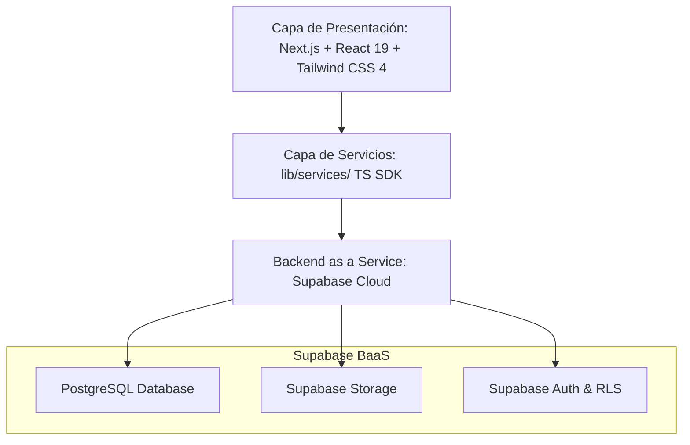

# Instituto Tecnológico Superior de Puerto Peñasco

---

## **PROYECTO INTEGRADOR**
### **DCK - Plataforma Web de Gestión de Residuos Marítimos**

**Ingeniería en Sistemas Computacionales**  
**6to Semestre**

**Maestros:**  
* Lopez Chaco Diana Elizabeth  
* Osuna Talamantes Daniel Alonso  

**Materias integradoras:**  
* Administración de Bases de Datos  
* Ingeniería de Software  

**Integrantes:**  
* Quintero Aldana Jesús Manuel  
* Sabori Fernández Miguel Rogelio  
* Suárez Gutiérrez Luis Mario  
* Zamudio Martín Alexa Merary  

*Puerto Peñasco, Sonora a 28 de Mayo del 2026*

---

# **Tabla de contenido**

1. [1. Planteamiento del problema](#1-planteamiento-del-problema)
   - [1.1 Introducción del proyecto](#11-introducción-del-proyecto)
   - [1.2 Datos de la empresa](#12-datos-de-la-empresa)
   - [1.3 Problemática](#13-problemática)
   - [1.4 Objetivo general y objetivos específicos](#14-objetivo-general-y-objetivos-específicos)
   - [1.5 Justificación](#15-justificación)
   - [1.6 Descripción de actividades por integrante de equipo](#16-descripción-de-actividades-por-integrante-de-equipo)
2. [2. Análisis del proyecto](#2-análisis-del-proyecto)
   - [2.1 Descripción de la fase de análisis](#21-descripción-de-la-fase-de-análisis)
   - [2.2 Descripción de los instrumentos aplicados](#22-descripción-de-los-instrumentos-aplicados)
3. [3. Diseño](#3-diseño)
   - [3.1 Descripción de la fase de diseño](#31-descripción-de-la-fase-de-diseño)
   - [3.2 Selección de colores, plantillas, logos y eslogan](#32-selección-de-colores-plantillas-logos-y-eslogan)
   - [3.3 Elección de la arquitectura del software](#33-elección-de-la-arquitectura-del-software)
4. [4. Desarrollo del proyecto](#4-desarrollo-del-proyecto)
   - [4.1 Justificación de las tecnologías utilizadas](#41-justificación-de-las-tecnologías-utilizadas)
   - [4.2 Presentación de la aplicación de software](#42-presentación-de-la-aplicación-de-software)
   - [4.3 Base de Datos y Diccionario de Datos](#43-base-de-datos-y-diccionario-de-datos)
   - [4.4 Tipos de usuarios y descripción de restricciones](#44-tipos-de-usuarios-y-descripción-de-restricciones)
   - [4.5 Presupuesto](#45-presupuesto)
   - [4.6 Redes y descripción de hardware necesario](#46-redes-y-descripción-de-hardware-necesario)
5. [5. Implementación](#5-implementación)
   - [5.1 Estado actual de la fase de implementación](#51-estado-actual-de-la-fase-de-implementación)
   - [5.2 Evidencia de las pruebas realizadas](#52-evidencia-de-las-pruebas-realizadas)
   - [5.3 Evidencia de la instalación y configuración final](#53-evidencia-de-la-instalación-y-configuración-final)
   - [5.4 Publicación del sistema](#54-publicación-del-sistema)
6. [Anexos](#anexos)
   - [Anexo A. Instrumento de entrevista aplicada](#anexo-a-instrumento-de-entrevista-aplicada)
   - [Anexo B. Primeros bocetos y mockups del sistema](#anexo-b-primeros-bocetos-y-mockups-del-sistema)
   - [Anexo C. Diagramas BPMN, Casos de Uso y Modelo de Base de Datos](#anexo-c-diagramas-bpmn-casos-de-uso-y-modelo-de-base-de-datos)
   - [Anexo D. Manual de Usuario](#anexo-d-manual-de-usuario)
   - [Anexo E. Manual Técnico](#anexo-e-manual-técnico)
   - [Anexo F. Manual de Instalación y Configuración](#anexo-f-manual-de-instalación-y-configuración)

---

# **1. Planteamiento del problema**

## **1.1 Introducción del proyecto**
El presente documento describe de forma exhaustiva el desarrollo e implementación del **Sistema DCK**, una plataforma web full-stack diseñada y construida para digitalizar y automatizar la gestión de residuos marinos sólidos y líquidos generados por la flota pesquera de Puerto Peñasco, Sonora. El proyecto fue iniciado en el ciclo escolar anterior como parte de la materia de Proyecto Integrador de 5° semestre y en este 6° semestre se consolida bajo un stack sumamente mantenible, potente y moderno: **Next.js 16 (con App Router), React 19, TypeScript y Supabase**, integrando materias fundamentales como **Administración de Bases de Datos** e **Ingeniería de Software**.

La plataforma reemplaza por completo el flujo operativo manual utilizado desde 2014, el cual dependía de formatos de papel autocopiables propensos al deterioro, archiveros físicos vulnerables a siniestros y una notable dificultad para extraer estadísticas inmediatas. En esta evolución tecnológica, el sistema añade un portal público cinematográfico que expone a la comunidad los logros acumulados de DCK en materia ecológica (litros de agua protegidos, kg de plástico capturados, etc.), una bitácora de auditoría detallada, un robusto módulo de respaldos con recordatorios, y amplias capacidades de accesibilidad adaptativa que mitigan la barrera cognitiva y visual de su principal operador final, el Sr. Francisco Javier Bojórquez Ochoa.

El sistema digitaliza el flujo de manifiestos desde la llegada del barco hasta el depósito final en el basurón municipal, garantizando la trazabilidad de aceites usados, filtros y basura general, con firmas electrónicas en canvas y persistencia automática en Supabase Storage de PDFs oficiales. **Actualmente, el sistema ya se encuentra desplegado y operando exitosamente en producción en la plataforma Vercel, habiéndose completado el registro y digitalización de alrededor de 741 manifiestos históricos facilitados directamente por el fundador, el señor Francisco, incluyendo la respectiva creación en el sistema de las diferentes personas (capitanes y tripulación) y sus correspondientes embarcaciones.**

---

## **1.2 Datos de la empresa**
* **Nombre de la Organización:** DCK (Conciencia y Cultura).
* **Fundador:** Sr. Francisco Javier Bojórquez Ochoa.
* **Ubicación:** Centro de Acopio del Recinto Portuario, Puerto Peñasco, Sonora, México.
* **Sector:** Organización civil e iniciativa ambiental para la recolección, clasificación y gestión responsable de residuos de embarcaciones pesqueras.
* **Colaboradores Clave:** SEMARNAT (Secretaría de Medio Ambiente y Recursos Naturales), SEMAR (Secretaría de Marina) y la Dirección de Ecología del Ayuntamiento de Puerto Peñasco, operando activamente en la zona de influencia de la Reserva de la Biósfera del Alto Golfo de California y Delta del Río Colorado.
* **Actividad Principal:** Recepción física, catalogación y depósito controlado de hidrocarburos usados, filtros saturados y basura de la flota camaronera y escamera del puerto, garantizando que no sean arrojados al Mar de Cortés y se dispongan correctamente con empresas autorizadas o en el relleno sanitario municipal (basurón).

---

## **1.3 Problemática**
A pesar de que el semestre pasado se entregó un prototipo funcional (desarrollado originalmente en *Astro + Golang + PostgreSQL* orquestado en Docker local), el análisis exhaustivo de campo y las mesas de diálogo con el operador revelaron las siguientes deficiencias operacionales:

1. **Stack de Mantenimiento Complejo:** La necesidad de dominar múltiples tecnologías dispares (Go para backend, Astro para frontend, Docker y scripts de despliegue manuales) sobrecargaba la curva de aprendizaje de futuros administradores técnicos.
2. **Deficiencias Extremas de Accesibilidad:** El usuario final del sistema presenta dificultades visuales bajo las condiciones de alta iluminación solar en el centro de acopio. El software requería opciones dedicadas de contraste, tamaño de tipografía incrementado y flujos guiados en una sola columna.
3. **Ausencia de Canal Público de Impacto:** La ciudadanía y autoridades desconocían el volumen de contaminantes interceptados. Hacía falta una Landing Page interactiva, bilingüe y moderna con estadísticas conectadas en tiempo real.
4. **Vulnerabilidad ante Pérdidas de Datos:** La inexistencia de un sistema de respaldos nativo forzaba a confiar ciegamente en backups automáticos del servidor, sin permitir descargas individuales en formatos legibles (CSV/JSON) por rangos de fechas de forma manual.
5. **Debilidad en la Trazabilidad del Relleno Sanitario:** El flujo se cortaba al registrar el barco; no existía un registro riguroso que vinculara la salida y peso en báscula de los residuos depositados finalmente en el Basurón Municipal, con sus respectivos comprobantes y tickets físicos escaneados.

---

## **1.4 Objetivo general y objetivos específicos**

### **Objetivo General**
Rediseñar, desarrollar e implementar la plataforma web full-stack **Sistema DCK** bajo una arquitectura Next.js 16 + React 19 + TypeScript y Supabase, logrando la trazabilidad completa del ciclo de residuos (barco - centro de acopio - basurón), con alta accesibilidad configurable, internacionalización (ES/EN), generación digital de respaldos y exposición pública del impacto ecológico acumulado.

### **Objetivos Específicos**
1. Migrar y optimizar el backend del sistema consolidando toda la base relacional en **Supabase** y explotando Row Level Security (RLS) para mayor protección.
2. Construir una **Landing Page interactiva y bilingüe** con identidad visual cinematográfica y contadores dinámicos que reflejen toneladas y equivalencias ecológicas calculadas al momento.
3. Diseñar e integrar un **SignaturePad basado en canvas HTML5** que capture de forma fluida la firma de hasta cuatro agentes responsables por manifiesto.
4. Desarrollar un **Módulo de Recibos del Basurón Municipal** con cálculo matemático automatizado de peso neto depositado y soporte para subida de fotos de tickets.
5. Crear una sección de **Ajustes y Apariencia** que permita al usuario alternar entre modos claro/oscuro e incrementar dinámicamente el tamaño de letra (hasta 20px).
6. Implementar un **Módulo de Respaldos Descargables** (en JSON y CSV) con selección de rangos de tiempo e inclusión de un índice de archivos del storage, junto a un recordatorio periódico.
7. Completar la documentación técnica del sistema, incluyendo los manuales requeridos para su entrega operativa.

---

## **1.5 Justificación**
* **Justificación Ambiental:** Puerto Peñasco colinda con el espectacular Mar de Cortés, una de las ecorregiones con mayor biodiversidad y hogar de especies vulnerables como la vaquita marina. Un solo galón de aceite lubricante usado tiene el potencial de arruinar el ecosistema de un millón de galones de agua dulce o marina. Digitalizar el control de estos desechos de la flota asegura el cabal cumplimiento de normativas de alta jerarquía como el **Convenio Internacional MARPOL (Anexo V)**, la **Ley General para la Prevención y Gestión Integral de los Residuos (LGPGIR)** de México, la **NOM-001-SEMARNAT-2021** y contribuye directamente al **Objetivo de Desarrollo Sostenible (ODS) 14.1** de la Organización de las Naciones Unidas (ONU).
* **Justificación Tecnológica:** El nuevo stack bajo Next.js 16 y Supabase simplifica enormemente la infraestructura. Al pasar de servidores autohospedados Docker a una arquitectura serverless administrada, se eliminan costos de mantenimiento técnico preventivo de servidores físicos y bases de datos locales. La adición de TypeScript incrementa drásticamente la robustez del código y reduce errores en tiempo de ejecución.
* **Justificación Social y Operativa:** Don Francisco cuenta ahora con herramientas de software que respetan sus condiciones visuales (tipografías masivas de 20px, altos contrastes), impidiendo el error humano en cálculos de pesaje o vaciado de manifiestos y agilizando las auditorías gubernamentales obligatorias que antes tomaban días de recolección de archivos físicos.

---

## **1.6 Descripción de actividades por integrante de equipo**

| **Integrante** | **Rol y Actividades Asignadas** |
| :--- | :--- |
| **Quintero Aldana Jesús Manuel** | **Líder de Captura y Documentación Digital:** Encargado del diseño y programación del módulo de Manifiestos de Barco. Implementó el `SignaturePad` basado en HTML5 canvas para firmas digitales táctiles, desarrolló la lógica de compresión de imágenes previas a la subida y programó la generación exacta de los PDFs mediante jsPDF + html2canvas. |
| **Sabori Fernández Miguel Rogelio** | **Analista de Datos y Estadísticas:** Responsable del módulo de Estadísticas, Reportes y el módulo de Recibos del Basurón Municipal. Implementó los gráficos reactivos interactivos con Recharts, la lógica matemática de cálculo de peso en báscula (entrada - salida), la exportación estructurada a formato CSV y la optimización de queries analíticos. |
| **Suárez Gutiérrez Luis Mario** | **Arquitecto de Software y Backend:** Configuró el repositorio unificado, estructuró la internacionalización (next-intl), diseñó y desarrolló la Landing Page con animaciones Ken Burns, programó el motor interactivo de Respaldos de Supabase a JSON/CSV en el frontend y optimizó la integración de Supabase Auth, Storage y base de datos con políticas de Row Level Security (RLS). |
| **Zamudio Martín Alexa Merary** | **Diseñadora de Interfaces (UX/UI) y Control de Calidad:** Diseñó el sistema visual (Glassmorphism Refinado) y sus componentes reutilizables (Botones, Modales, Tablas), coordinó y aplicó las entrevistas cualitativas al Sr. Bojórquez, implementó el panel de configuraciones globales de accesibilidad (tamaño de letra y modo oscuro) y programó los CRUDs de soporte (Personas, Embarcaciones y Asociaciones). |

---

# **2. Análisis del proyecto**

## **2.1 Descripción de la fase de análisis**
El análisis del proyecto consistió en diagnosticar con precisión el estado funcional y los cuellos de botella del sistema entregado previamente y evaluar los requerimientos operativos reales de la organización. A través de este análisis se definieron los requerimientos funcionales (RF) y no funcionales (RNF) del sistema:

### **Requerimientos Funcionales (RF)**
* **RF-01 (Manifiestos de Barco):** Registrar entregas de residuos con datos del buque, fecha de inspección, cantidades de aceite usado (litros), filtros de aceite, filtros de diésel, filtros de aire (piezas), basura general (kg) y observaciones.
* **RF-02 (Generador de Códigos Únicos):** Generar de forma automática un código de manifiesto en formato `MAN{ddmmyyyy}{NNN}` (reiniciando secuenciales diariamente).
* **RF-03 (Firmas Digitales):** Capturar firmas electrónicas mediante panel táctil canvas para motorista, cocinero, oficial y receptor del centro de acopio.
* **RF-04 (Generador de Documentos Oficiales):** Generar dinámicamente un documento PDF del manifiesto que se guarde en Supabase Storage.
* **RF-05 (Módulo del Basurón Municipal):** Registrar fecha, hora de entrada y salida, peso de entrada y salida, y calcular automáticamente el total de basura depositado (Peso Entrada - Peso Salida).
* **RF-06 (Estadísticas Dinámicas):** Mostrar un panel analítico con métricas comparativas temporales y gráficos interactivos de barras, líneas y áreas con Recharts.
* **RF-07 (CRUD de Soporte):** Proporcionar interfaces funcionales y paginadas de búsqueda para Personas, Embarcaciones y Asociaciones Recolectoras.
* **RF-08 (Landing Page de Impacto):** Mostrar un portal público con contadores de equivalencias ecológicas calculadas directamente de la base de datos Supabase en tiempo real.
* **RF-09 (Sistema de Respaldos Manual):** Permitir la exportación selectiva e integral de toda la base de datos Supabase y archivos del storage en archivos JSON y CSV.
* **RF-10 (Recordatorios Inteligentes):** Emitir un aviso configurable en el dashboard si no se ha realizado un respaldo en el periodo asignado.
* **RF-11 (Autenticación Avanzada):** Controlar accesos vía Supabase Auth (correo, contraseña y código OTP).
* **RF-12 (Timeout de Inactividad):** Forzar el cierre de sesión automáticamente tras 30 minutos de inactividad del usuario.

### **Requerimientos No Funcionales (RNF)**
* **RNF-01 (Accesibilidad del Operador):** Ofrecer modo claro/oscuro persistente y 4 niveles globales de escala tipográfica (14px, 16px, 18px y 20px) guardados en localStorage.
* **RNF-02 (Internacionalización - i18n):** Traducir dinámicamente el 100% de la aplicación al español e inglés según el prefijo dinámico de la URL (ej. `/es/dashboard`).
* **RNF-03 (Desempeño y Velocidad):** Tiempos de carga de pantallas inferiores a 2.5 segundos e interactividad instantánea en el filtrado de gráficas.
* **RNF-04 (Seguridad de Datos):** Protección de todas las tablas con políticas activas de Row Level Security (RLS) a nivel de fila.
* **RNF-05 (Responsividad Fluida):** Adaptabilidad completa para tabletas (firma en campo) y computadoras de escritorio.

---

## **2.2 Descripción de los instrumentos aplicados**
La recopilación de información y validación de necesidades se realizó aplicando un **enfoque cualitativo e inductivo** a través de:

1. **Entrevista Semiestructurada:** Diseñada con un guion específico de 18 preguntas abiertas aplicadas al Sr. Francisco Javier Bojórquez en dos sesiones directamente en el centro de acopio (ver Guion y Respuestas completas en el [Anexo A](#anexo-a-instrumento-de-entrevista-aplicada)). Esto permitió identificar las necesidades ergonómicas de la pantalla (problemas visuales) y la urgencia de agilizar los reportes ante inspectores federales.
2. **Observación Directa Participativa:** Visitas de campo durante la descarga real de una embarcación para constatar el manejo de los tickets del basurón municipal y el llenado de firmas digitales en dispositivos móviles.
3. **Análisis de Documentos Físicos Históricos:** Revisión de las bitácoras archivadas desde 2014 para asegurar que los límites y tipos de datos del esquema relacional reflejen de forma exacta el historial de la organización.

---

# **3. Diseño**

## **3.1 Descripción de la fase de diseño**
El diseño del sistema responde a dos objetivos prioritarios: **reducción drástica de fricción visual para el operador principal** y **mantenibilidad del código para futuros programadores**. Se diseñó una interfaz estructurada bajo el concepto de **Glassmorphism Refinado**. Este estilo recurre a transparencias controladas, desenfoques de fondo (backdrop blurs) sutiles y bordes finos de color blanco semitransparente, generando capas de información que ordenan mentalmente la navegación.

Se dio preferencia al **Modo Oscuro como visualización base**, ya que mitiga la fatiga ocular del operador en ambientes costeros soleados. Los flujos de entrada de datos (como registrar un manifiesto) fueron reestructurados como **Wizards Secuenciales Paso a Paso** para evitar abrumar al usuario con un único panel visualmente saturado.

---

## **3.2 Selección de colores, plantillas, logos y eslogan**

### **Paleta de Colores Corporativa**
* **Azul Primario de Acción (#3b82f6 - blue-500):** Se usa para disparadores, botones primarios e indicadores activos.
* **Azul Hover (#2563eb - blue-600):** Transiciones suaves de selección.
* **Teal Acento (#14b8a6 - teal-500):** Detalles ecológicos y gradientes modernos.
* **Esmeralda Éxito (#10b981 - emerald-500):** Confirmaciones y estados completados.
* **Rojo Peligro (#ef4444 - red-500):** Disparadores de borrado e indicadores de error.
* **Ámbar Advertencia (#f59e0b - amber-500):** Mensajes de alerta y recordatorios de respaldo.
* **Gris Neutro (#111827 / rgba(17, 24, 39, 0.08)):** Estilo base del Sidebar y fondo de tarjetas semitransparentes.

### **Tipografía**
* **Familia Tipográfica:** `Geist Sans` (como fuente sans-serif moderna altamente legible) y `Geist Mono` para números de ticket y datos tabulares.
* **Escalado Tipográfico:**
  * Títulos de página: `text-3xl font-bold` a `text-4xl font-black` (24px - 36px).
  * Subtítulos de sección: `text-lg font-bold` (18px - 20px).
  * Etiquetas e identificadores: `text-xs font-semibold uppercase tracking-wider` (12px).
  * Cuerpo estándar: `text-sm` a `text-base` (14px - 16px).

### **Logotipos e Identidad Gráfica**
La identidad de la aplicación combina de forma solemne e institucional el logotipo histórico de **DCK Conciencia y Cultura**, el imagotipo del **Instituto Tecnológico Superior de Puerto Peñasco (ITSPP)** y el escudo de armas del centro de acopio marítimo. En la Landing Page, estas marcas aparecen de manera minimalista e integrada, mientras que en el dashboard se posicionan de manera estática y compacta sobre la barra lateral.

### **Eslogan**
*"Conciencia y Cultura para un Mar de Cortés más limpio"*

---

## **3.3 Elección de la arquitectura del software**
Se adoptó una arquitectura **monolítica moderna basada en Next.js 16 con App Router**, la cual divide la computación entre **Server Components** (para el renderizado óptimo en servidor y SEO de la landing page pública) y **Client Components** (para la captura del canvas y reactividad de formularios interactivos).

La arquitectura se divide en 3 capas fundamentales:



1. **Capa de Presentación:** Estructuras visuales montadas en React y estilizadas mediante clases de utilidad de Tailwind CSS 4, permitiendo empaquetados ultraligeros.
2. **Capa de Servicios (Service Layer):** Archivos específicos en `lib/services/` (ej. `manifiestos.ts`, `backups.ts`, `personas.ts`) que encapsulan por completo las llamadas HTTPS y consultas relacionales, aislando la lógica de negocio de los componentes de UI.
3. **Capa de Persistencia e Infraestructura (BaaS):** Controlada por **Supabase**, la cual proporciona de forma integrada la base de datos relacional PostgreSQL, el almacén de archivos (Storage), autenticación, y control de seguridad a nivel de fila (RLS).

---

# **4. Desarrollo del proyecto**

## **4.1 Justificación de las tecnologías utilizadas**

* **Next.js 16 (App Router):** Elegido por su extraordinario rendimiento en la compilación con Turbopack, facilidad de enrutamiento basado en directorios y soporte nativo para layouts anidados.
* **React 19:** Permite el uso de hooks avanzados y Server Components que disminuyen los recursos consumidos en el navegador cliente.
* **TypeScript 5:** Proporciona tipado estático estricto (definido en `/types/database.ts`), impidiendo errores de paso de argumentos entre el frontend y Supabase durante el desarrollo.
* **Tailwind CSS 4:** Framework de diseño veloz e integrado con PostCSS. Soporta el modo oscuro nativo de manera sumamente ágil mediante selectores.
* **Supabase Cloud (PostgreSQL):** Evita la necesidad de gestionar, configurar y mantener un servidor físico local para la base de datos.
* **next-intl (v4):** Librería líder para manejo robusto de internacionalización a través de segmentos dinámicos en la URL, leyendo archivos estructurados JSON de forma optimizada.
* **Recharts:** Librería de gráficos interactivos, responsivos y declarativos para React, idónea para mostrar estadísticas analíticas sin penalizar el rendimiento.
* **jsPDF + html2canvas:** Kit que permite renderizar el manifiesto completo como un canvas de imagen e insertarlo vectorialmente dentro de un documento PDF oficial descargable y autoprocesado en el navegador del operador.
* **xlsx (SheetJS):** Librería veloz para la compilación y escritura directa de archivos de hoja de cálculo Excel (respaldos y reportes).

---

## **4.2 Presentación de la aplicación de software**

### **Módulos Principales del Sistema**

1. **Landing Page Cinematográfica pública (`app/[locale]/page.tsx`):**
   * Incorpora un carrusel dinámico en pantalla completa con fotografías reales de Puerto Peñasco con un filtro degradado tipo noche marina.
   * Expone contadores animados de impacto en tiempo real: Manifiestos procesados, toneladas totales e impacto en equivalencias ecológicas calculadas desde Supabase.
   * Botón de ingreso interactivo que despliega el login directamente en un modal animado de alto impacto visual.
2. **Formulario de Login Inteligente (`app/[locale]/login/page.tsx`):**
   * Tarjeta minimalista central que encapsula cinco flujos de autenticación en una sola vista: ingreso estándar, registro de operadores, recuperación de clave, ingreso por código OTP y reseteo.
3. **Dashboard Administrativo Principal (`app/[locale]/dashboard/page.tsx`):**
   * Panel centrado en accesos directos de tamaño gigante (tarjetas de manifiestos, basurón y estadísticas) y tres KPIs superiores de volumen y actividad de barcos.
4. **Módulo de Manifiestos de Barco (`/dashboard/manifiesto`):**
   * Asistente secuencial estructurado por pasos:
     * *Paso 1 (Embarcación y Fecha):* Búsqueda inteligente de embarcaciones activas y selección de fecha con `react-datepicker`.
     * *Paso 2 (Cantidades de Residuos):* Inputs con validación de tipo numérico para aceites usados, filtros e indicación visual de métricas.
     * *Paso 3 (Firmas Digitales):* 4 canvas independientes para motorista, cocinero, oficial y receptor del centro de acopio.
     * *Paso 4 (Carga de Evidencia):* Módulo de drag-and-drop para cargar fotos escaneadas comprimidas automáticamente mediante `browser-image-compression` para ahorrar almacenamiento.
5. **Módulo del Basurón Municipal (`/dashboard/manifiesto-basuron`):**
   * Captura el pesaje en básculas municipales (Entrada y Salida), calculando dinámicamente los kilogramos netos depositados. Guarda el número de ticket y el comprobante oficial.
6. **Módulo Analítico de Estadísticas (`/dashboard/estadisticas`):**
   * Permite filtrar datos por periodos temporales (semana, mes, trimestre, año, personalizado). Muestra gráficos interactivos de barras, líneas y áreas que detallan la tendencia de recolección de aceites y basura general.
7. **CRUDs de Catálogos (Personas, Embarcaciones y Asociaciones):**
   * Listados interactivos paginados, con búsquedas globales rápidas y filtros avanzados para gestionar el padrón de motoristas, capitanes y embarcaciones del puerto.
8. **Módulo de Respaldos de Información (Configuraciones):**
   * Permite la descarga directa de toda la base de datos relacional y archivos en formatos JSON y CSV, con indicadores de barra de progreso interactivos por tabla. Incluye el recordatorio configurable de periodicidad (semanal, quincenal, mensual).

---

## **4.3 Base de Datos y Diccionario de Datos**

### **Modelo de la Base de Datos**
La base de datos PostgreSQL de Supabase está altamente estructurada y normalizada en Tercera Forma Normal (3FN), garantizando la máxima integridad referencial y evitando la redundancia de datos. Está compuesta por 13 tablas relacionales (los tipos nativos de TypeScript se especifican en `types/database.ts`).

### **Diccionario de Datos Exhaustivo**

#### **1. Tabla: `tipos_persona`**
Define el catálogo de roles o clasificaciones que puede tener una persona dentro de la plataforma (ej. Motorista, Cocinero, Capitán).
* **`id`** (`BIGINT`, PK, Auto-increment): Identificador único de la categoría.
* **`nombre_tipo`** (`TEXT`, Unique, Not Null): Nombre legible de la categoría (ej. 'Capitán', 'Tripulante', 'Motorista', 'Responsable de Líquidos').
* **`descripcion`** (`TEXT`, Nullable): Descripción detallada del rol o perfil.
* **`created_at`** (`TIMESTAMP WITH TIME ZONE`, Default `NOW()`): Registro de auditoría temporal de creación.
* **`updated_at`** (`TIMESTAMP WITH TIME ZONE`, Default `NOW()`): Fecha del último cambio del registro.

#### **2. Tabla: `personas`**
Almacena el padrón general de capitanes, tripulantes y personal operativo relacionado con los barcos o el centro de acopio.
* **`id`** (`BIGINT`, PK, Auto-increment): Identificador único de la persona.
* **`nombre`** (`TEXT`, Not Null): Nombre completo de la persona.
* **`tipo_persona_id`** (`BIGINT`, FK -> `tipos_persona(id)`, On Delete Set Null): Categoría o rol de la persona.
* **`info_contacto`** (`TEXT`, Nullable): Correo, teléfono o datos de contacto.
* **`created_at`** (`TIMESTAMP WITH TIME ZONE`, Default `NOW()`): Fecha de registro en el sistema.
* **`updated_at`** (`TIMESTAMP WITH TIME ZONE`, Default `NOW()`): Última modificación.

#### **3. Tabla: `buques`**
Almacena el inventario de embarcaciones pesqueras activas, pangas o barcos industriales que arriban al puerto.
* **`id`** (`BIGINT`, PK, Auto-increment): Identificador de la embarcación.
* **`nombre_buque`** (`TEXT`, Not Null): Nombre oficial del buque.
* **`tipo_buque`** (`TEXT`, Nullable): Categoría de buque (ej. Barco Camaronero, Escamero, Panga).
* **`propietario_id`** (`BIGINT`, FK -> `personas(id)`, On Delete Set Null): FK al propietario de la embarcación.
* **`fecha_registro`** (`DATE`, Default `CURRENT_DATE`): Fecha de alta del buque.
* **`matricula`** (`TEXT`, Unique, Nullable): Matrícula oficial de navegación ante Capitanía de Puerto.
* **`puerto_base`** (`TEXT`, Nullable): Puerto de origen de la embarcación (ej. Puerto Peñasco, Guaymas).
* **`capacidad_toneladas`** (`NUMERIC(10,2)`, Nullable): Capacidad total en toneladas métricas de carga del buque.
* **`estado`** (`TEXT`, Default 'Activo', Check Constraint: 'Activo', 'Inactivo', 'En Mantenimiento'): Estado operacional.
* **`created_at / updated_at`** (`TIMESTAMP WITH TIME ZONE`, Default `NOW()`): Timestamps de control.

#### **4. Tabla: `tipos_residuos`**
Catálogo maestro de clasificación y métricas de los distintos tipos de residuos marinos aceptados en el centro de acopio.
* **`id`** (`BIGINT`, PK, Auto-increment): Identificador único del residuo.
* **`nombre_tipo`** (`TEXT`, Unique, Not Null): Nombre del residuo (ej. 'Aceites usados', 'Filtros de aceite', 'Basura general').
* **`metrica`** (`TEXT`, Default 'kg'): Unidad de medida utilizada (ej. 'litros', 'unidades', 'kg').
* **`descripcion`** (`TEXT`, Nullable): Breve explicación del residuo.
* **`categoria`** (`TEXT`, Nullable): Clasificación general (ej. 'Químico', 'Plástico', 'Metal').
* **`peligrosidad`** (`TEXT`, Default 'Baja', Check Constraint: 'Baja', 'Media', 'Alta'): Clasificación ante SEMARNAT.
* **`created_at / updated_at`** (`TIMESTAMP WITH TIME ZONE`, Default `NOW()`): Auditoría.

#### **5. Tabla: `usuarios_sistema`**
Almacena las credenciales y perfiles de los operadores administrativos de DCK que tienen acceso a la plataforma privada.
* **`id`** (`BIGINT`, PK, Auto-increment): ID del usuario.
* **`nombre_usuario`** (`TEXT`, Unique, Not Null): Nickname de acceso del operador.
* **`rol`** (`TEXT`, Default 'Usuario', Check: 'Administrador', 'Usuario', 'Supervisor', 'Inspector'): Rol de seguridad.
* **`contacto_usuario`** (`TEXT`, Nullable): Teléfono o detalles adicionales.
* **`email`** (`TEXT`, Unique, Not Null): Dirección de correo oficial ligada a Supabase Auth.
* **`hash_contraseña`** (`TEXT`, Not Null): Clave de acceso encriptada.
* **`estado`** (`TEXT`, Default 'Activo', Check: 'Activo', 'Inactivo', 'Suspendido'): Estado del usuario.
* **`ultimo_acceso`** (`TIMESTAMP WITH TIME ZONE`, Nullable): Registro de última sesión.
* **`created_at / updated_at`** (`TIMESTAMP WITH TIME ZONE`, Default `NOW()`): Timestamps.

#### **6. Tabla: `cumplimiento`**
Registra las actas de inspección ambiental y de seguridad para las embarcaciones antes o después de la recolección de residuos.
* **`id`** (`BIGINT`, PK, Auto-increment): ID único de inspección.
* **`buque_id`** (`BIGINT`, FK -> `buques(id)`, On Delete Cascade): FK del buque inspeccionado.
* **`fecha_inspeccion`** (`DATE`, Default `CURRENT_DATE`): Fecha del acta.
* **`observaciones`** (`TEXT`, Nullable): Comentarios sobre el cumplimiento de las normas.
* **`usuario_sistema_id`** (`BIGINT`, FK -> `usuarios_sistema(id)`, On Delete Set Null): FK del inspector.
* **`calificacion`** (`TEXT`, Check: 'Excelente', 'Bueno', 'Regular', 'Deficiente'): Nota cualitativa.
* **`estado`** (`TEXT`, Default 'Pendiente', Check: 'Pendiente', 'Aprobado', 'Rechazado'): Dictamen.
* **`documento_url`** (`TEXT`, Nullable): Ruta de evidencia digital en storage.
* **`created_at / updated_at`** (`TIMESTAMP WITH TIME ZONE`, Default `NOW()`): Auditoría.

#### **7. Tabla: `residuos`**
Bitácora de residuos detallados a nivel individual por embarcación para análisis analítico de generación histórica.
* **`id`** (`BIGINT`, PK, Auto-increment): ID único.
* **`buque_id`** (`BIGINT`, FK -> `buques(id)`, On Delete Cascade): FK del buque que originó el residuo.
* **`tipo_residuo_id`** (`BIGINT`, FK -> `tipos_residuos(id)`, On Delete Set Null): FK al catálogo de residuos.
* **`cantidad_generada`** (`NUMERIC(10,2)`, Not Null, Check >= 0): Cantidad neta reportada.
* **`fecha_generacion`** (`DATE`, Default `CURRENT_DATE`): Fecha del reporte.
* **`cumplimiento_id`** (`BIGINT`, FK -> `cumplimiento(id)`, On Delete Set Null): FK vinculante a la inspección.
* **`estado`** (`TEXT`, Default 'Generado', Check: 'Generado', 'Almacenado', 'Recolectado', 'Procesado'): Etapa en la que se encuentra.
* **`ubicacion_almacenamiento`** (`TEXT`, Nullable): Contenedor físico de acopio.
* **`observaciones`** (`TEXT`, Nullable): Anotaciones.
* **`created_at / updated_at`** (`TIMESTAMP WITH TIME ZONE`, Default `NOW()`): Timestamps.

#### **8. Tabla: `asociaciones_recolectoras`**
Directorio de empresas, cooperativas u organizaciones externas que participan en el transporte o disposición autorizada de residuos.
* **`id`** (`BIGINT`, PK, Auto-increment): ID único.
* **`nombre_asociacion`** (`TEXT`, Unique, Not Null): Razón social de la organización recolectora.
* **`tipo_asociacion`** (`TEXT`, Nullable): Tipo de figura (ej. Cooperativa, Empresa Privada, Organización Gubernamental).
* **`contacto_asociacion`** (`TEXT`, Nullable): Nombre del representante ante DCK.
* **`email`** (`TEXT`, Nullable): Correo institucional.
* **`telefono`** (`TEXT`, Nullable): Teléfono de oficina.
* **`direccion`** (`TEXT`, Nullable): Domicilio legal de la asociación.
* **`certificaciones`** (`TEXT[]`, Nullable): Arreglo de certificaciones aprobadas (ej. SEMARNAT-2025).
* **`especialidad`** (`TEXT[]`, Nullable): Tipos de residuos que están autorizados para procesar (ej. Aceite Usado).
* **`estado`** (`TEXT`, Default 'Activo', Check: 'Activo', 'Inactivo', 'Suspendido'): Estado legal.
* **`created_at / updated_at`** (`TIMESTAMP WITH TIME ZONE`, Default `NOW()`): Timestamps.

#### **9. Tabla: `reutilizacion_residuos`**
Control de la salida de residuos del centro de acopio para procesos de economía circular y reciclaje por asociaciones externas.
* **`id`** (`BIGINT`, PK, Auto-increment): ID de control de salida.
* **`residuo_id`** (`BIGINT`, FK -> `residuos(id)`, On Delete Cascade): ID de residuos de origen.
* **`asociacion_id`** (`BIGINT`, FK -> `asociaciones_recolectoras(id)`, On Delete Set Null): FK a la asociación que retira el residuo.
* **`fecha_reutilizacion`** (`DATE`, Default `CURRENT_DATE`): Fecha del retiro físico.
* **`cantidad_reutilizada`** (`NUMERIC(10,2)`, Not Null, Check >= 0): Volumen entregado.
* **`metodo_reutilizacion`** (`TEXT`, Nullable): Tratamiento industrial que se dará (ej. Co-procesamiento, Reciclaje).
* **`producto_final`** (`TEXT`, Nullable): Subproducto resultante (ej. Combustible alterno, Plástico compactado).
* **`impacto_ambiental`** (`TEXT`, Nullable): Resumen cualitativo del impacto.
* **`costo_proceso`** (`NUMERIC(10,2)`, Nullable): Costo de transporte/procesamiento de residuos.
* **`ingreso_generado`** (`NUMERIC(10,2)`, Nullable): Ganancia o apoyo de recuperación obtenido.
* **`observaciones`** (`TEXT`, Nullable): Anotaciones.
* **`created_at / updated_at`** (`TIMESTAMP WITH TIME ZONE`, Default `NOW()`): Timestamps.

#### **10. Tabla: `manifiestos`**
Tabla core que almacena las cabeceras de los manifiestos de residuos digitales generados en el centro de acopio de DCK.
* **`id`** (`BIGINT`, PK, Auto-increment): ID del manifiesto.
* **`numero_manifiesto`** (`TEXT`, Unique, Not Null): Código estructurado autogenerado.
* **`fecha_emision`** (`DATE`, Not Null, Default `CURRENT_DATE`): Fecha de firma y generación.
* **`buque_id`** (`BIGINT`, FK -> `buques(id)`, On Delete Set Null): FK de la embarcación que realiza la descarga.
* **`responsable_principal_id`** (`BIGINT`, FK -> `personas(id)`, On Delete Set Null): FK al motorista o tripulante firmante.
* **`responsable_secundario_id`** (`BIGINT`, FK -> `personas(id)`, On Delete Set Null): FK al cocinero o segundo tripulante firmante.
* **`imagen_manifiesto_url`** (`TEXT`, Nullable): URL de la imagen del manifiesto original subida a Supabase Storage.
* **`pdf_manifiesto_url`** (`TEXT`, Nullable): URL del PDF autogenerado subido en Supabase Storage.
* **`estado_digitalizacion`** (`TEXT`, Default 'pendiente', Check: 'pendiente', 'en_proceso', 'completado'): Estado del flujo.
* **`digitalizador_id`** (`BIGINT`, FK -> `usuarios_sistema(id)`, On Delete Set Null): ID de usuario que digitalizó.
* **`fecha_digitalizacion`** (`DATE`, Nullable): Fecha de registro digital.
* **`observaciones`** (`TEXT`, Nullable): Anotaciones generales.
* **`created_at / updated_at`** (`TIMESTAMP WITH TIME ZONE`, Default `NOW()`): Timestamps.

#### **11. Tabla: `manifiestos_residuos`**
Almacena el volumen total de residuos detallado ligado a un manifiesto particular de barco (Relación 1:1 con `manifiestos`).
* **`id`** (`BIGINT`, PK, Auto-increment): ID de detalle.
* **`manifiesto_id`** (`BIGINT`, Unique, Not Null, FK -> `manifiestos(id)`, On Delete Cascade): FK del manifiesto cabecera.
* **`aceite_usado`** (`NUMERIC(10,2)`, Default 0, Check >= 0): Litros netos de aceite capturados.
* **`filtros_aceite`** (`INTEGER`, Default 0, Check >= 0): Piezas de filtros de aceite lubricante.
* **`filtros_diesel`** (`INTEGER`, Default 0, Check >= 0): Piezas de filtros de diésel saturados.
* **`filtros_aire`** (`INTEGER`, Default 0, Check >= 0): Piezas de filtros de aire capturadas.
* **`basura`** (`NUMERIC(10,2)`, Default 0, Check >= 0): Kilogramos de basura inorgánica general.
* **`observaciones`** (`TEXT`, Nullable): Comentarios específicos del cargamento.
* **`created_at / updated_at`** (`TIMESTAMP WITH TIME ZONE`, Default `NOW()`): Timestamps.

#### **12. Tabla: `manifiesto_basuron`**
Registra la salida física de residuos inorgánicos generales del centro de acopio de DCK con destino al Basurón Municipal.
* **`id`** (`BIGINT`, PK, Auto-increment): ID único de control de pesaje.
* **`fecha`** (`DATE`, Not Null, Default `CURRENT_DATE`): Fecha del ticket de báscula municipal.
* **`hora_entrada`** (`TIME WITHOUT TIME ZONE`, Not Null): Hora de ingreso del camión al vertedero.
* **`hora_salida`** (`TIME WITHOUT TIME ZONE`, Nullable): Hora de egreso.
* **`peso_entrada`** (`NUMERIC(10,2)`, Not Null, Check >= 0): Peso del camión cargado en báscula (kg).
* **`peso_salida`** (`NUMERIC(10,2)`, Nullable, Check >= 0): Peso del camión vacío en báscula (kg).
* **`total_depositado`** (`NUMERIC(10,2)`, Generated Always As `peso_entrada - peso_salida` Stored): Cálculo del residuo real depositado.
* **`observaciones`** (`TEXT`, Nullable): Anotaciones.
* **`buque_id`** (`BIGINT`, Not Null, FK -> `buques(id)`, On Delete Cascade): Embarcación a la que se le atribuye la basura.
* **`usuario_sistema_id`** (`BIGINT`, FK -> `usuarios_sistema(id)`, On Delete Set Null): FK del operador que valida.
* **`estado`** (`TEXT`, Default 'En Proceso', Check: 'En Proceso', 'Completado', 'Cancelado'): Estado de validación.
* **`numero_ticket`** (`TEXT`, Unique): Código generado automáticamente en base al trigger de inserción.
* **`tipo_residuo_id`** (`BIGINT`, FK -> `tipos_residuos(id)`, On Delete Set Null): FK del tipo de residuo.
* **`comprobante_url`** (`TEXT`, Nullable): Foto del ticket físico oficial del relleno sanitario en el bucket.
* **`created_at / updated_at`** (`TIMESTAMP WITH TIME ZONE`, Default `NOW()`): Timestamps de control.

#### **13. Tabla: `manifiestos_no_firmados`**
Controla e identifica aquellos manifiestos que fueron creados de forma express pero que aún no cuentan con todas las firmas requeridas.
* **`id`** (`BIGINT`, PK, Auto-increment): Identificador único.
* **`manifiesto_id`** (`BIGINT`, FK -> `manifiestos(id)`, On Delete Cascade): ID de manifiesto asociado.
* **`nombre_archivo`** (`TEXT`, Not Null): Nombre de archivo temporal asignado.
* **`ruta_archivo`** (`TEXT`, Not Null): Dirección física del recurso.
* **`url_descarga`** (`TEXT`, Nullable): URL temporal de descarga.
* **`numero_manifiesto`** (`TEXT`, Not Null): Número de manifiesto.
* **`fecha_generacion`** (`TIMESTAMP WITH TIME ZONE`, Default `NOW()`): Fecha de alta temporal.
* **`estado`** (`TEXT`, Default 'pendiente', Check: 'pendiente', 'descargado', 'firmado', 'cancelado'): Estado.
* **`created_at / updated_at`** (`TIMESTAMP WITH TIME ZONE`, Default `NOW()`): Timestamps.

---

### **Buckets de Supabase Storage**
El almacenamiento y persistencia de archivos digitales se estructura en tres repositorios en la nube (buckets) administrados con políticas de RLS restrictivas:
1. **`manifiestos_img`:** Contiene las fotos directas de los manifiestos tradicionales impresos en papel, cargadas como evidencias.
2. **`manifiestos_pdf`:** Repositorio estructurado de los PDFs autogenerados digitalmente con firma digital vectorizada para cada barco.
3. **`manifiestos_basuron_pdf`:** Archivos PDF generados de los recibos y actas oficiales de pesaje en el Relleno Sanitario Municipal.

---

## **4.4 Tipos de usuarios y descripción de restricciones**

### **Matriz de Roles y Permisos**

| **Rol de Usuario** | **Acciones Autorizadas** | **Restricciones del Sistema** |
| :--- | :--- | :--- |
| **Administrador** (Don Francisco) | Acceso total al sistema. CRUD de catálogos completo, generación de respaldos, firma e impresión de manifiestos y visualización total de reportes. | Ninguna restricción dentro de la plataforma corporativa. |
| **Capturista del Basurón** (Previsto) | Alta y validación de registros únicamente en el módulo de manifiestos del basurón municipal y carga de tickets. | Bloqueo absoluto de acceso a CRUD de catálogos, configuraciones del sistema, estadísticas de barcos y respaldos de información. |
| **Inspector Gubernamental / Reportes** | Acceso de solo lectura al módulo de reportes y estadísticas complejas de aceites y basura inorgánica. | Impedimento total para realizar cualquier operación de inserción (INSERT), modificación (UPDATE) o borrado (DELETE) en la base de datos. |
| **Visitante Público** | Visualización de la Landing Page pública y métricas ecológicas agregadas en tiempo real. | Bloqueo de entrada a cualquier vista bajo la ruta privada `/dashboard/`. |

### **Políticas de Row Level Security (RLS) en Supabase**
Cada tabla del motor PostgreSQL en Supabase tiene activado Row Level Security de forma estricta. El acceso a datos se valida en el servidor mediante directivas como:
```sql
-- Ejemplo de RLS activado sobre la tabla manifiestos
ALTER TABLE manifiestos ENABLE ROW LEVEL SECURITY;

-- Política que permite a cualquier usuario autenticado ver manifiestos
CREATE POLICY "Permitir consulta a autenticados" 
ON manifiestos FOR SELECT 
TO authenticated 
USING (true);

-- Política que restringe la inserción exclusivamente a usuarios con rol administrativo
CREATE POLICY "Permitir inserción a administradores" 
ON manifiestos FOR INSERT 
TO authenticated 
WITH CHECK (auth.jwt() ->> 'email' IN (SELECT email FROM usuarios_sistema WHERE rol = 'Administrador'));
```
* **Timeout de Sesión Seguro:** Se configuró un token JWT de Supabase de corta duración, forzando un cierre completo y expiración de sesión tras **30 minutos de inactividad** del ratón o teclado en el cliente.

---

## **4.5 Presupuesto**

### **Costos de Desarrollo (Proyecto Académico)**
Al ser concebido y desarrollado bajo el esquema de Proyecto Integrador de la carrera de Ingeniería en Sistemas Computacionales del ITSPP, el costo de las horas hombre se estipula en cero pesos ($0 MXN).

* **Análisis y Diseño de Experiencia (UX/UI):** 80 horas.
* **Desarrollo del Frontend (Next.js 16 + React 19):** 200 horas.
* **Desarrollo del Backend y Configuración (Supabase Cloud + RLS):** 60 horas.
* **Fase de Integración y Pruebas Unitarias:** 40 horas.
* **Documentación Académica y Manuales:** 30 horas.
* **Total de Horas Hombre Invertidas:** **410 horas**.

### **Costo Referencial Comercial (Valor Real de Mercado)**
Si la organización DCK decidiera cotizar comercialmente este desarrollo con un equipo profesional de ingeniería de software a tarifas competitivas estándar de mercado en México ($250.00 MXN / hora promedio de consultoría junior/mid), el valor real del software ascendería a:
* *Desarrollo e Ingeniería de Software:* 410 horas × $250.00 MXN = **$102,500.00 MXN (más IVA)**.

### **Costos de Infraestructura y Operación Anual (Producción)**

| **Concepto de Infraestructura** | **Detalle Técnico** | **Costo Anual Mínimo (Tier Libre)** | **Costo Anual Recomendado (Tier Pro)** |
| :--- | :--- | :--- | :--- |
| **Supabase Cloud (PostgreSQL)** | Almacena hasta 500 MB de base de datos relacional y 1 GB de storage en el plan gratuito. | $0.00 MXN | $6,000.00 MXN (~$25 USD/mes) |
| **Vercel Hosting** | Hosting serverless con CDN global optimizado para Next.js. Tier gratuito. | $0.00 MXN | $4,800.00 MXN (~$20 USD/mes) |
| **Dominio Personalizado** | Adquisición anual del dominio (ej. `dckconciencia.org` o `dck.mx`). | $400.00 MXN | $400.00 MXN |
| **Mantenimiento Técnico** | Bolsa de soporte eventual para actualizaciones e incidencias (24 horas anuales). | $0.00 MXN | $6,000.00 MXN |
| **TOTAL ESTIMADO ANUAL:** | | **$400.00 MXN** | **$17,200.00 MXN** |

---

## **4.6 Redes y descripción de hardware necesario**

### **Arquitectura de Red y Flujo de Comunicación**
La plataforma del Sistema DCK opera enteramente bajo una infraestructura distribuida en la nube con protocolo seguro HTTPS (TLS 1.3). El flujo de la red se detalla en el siguiente esquema:

```
[Dispositivo Cliente (PC/Tablet)] 
       │ (Acceso HTTPS a dck.mx)
       ▼
[Vercel CDN Global] ── (Servidor de Archivos Estáticos y Server Components)
       │
       ├─► [Supabase Auth] (Autenticación JWT y Código OTP)
       ├─► [Supabase Storage] (Carga de Fotos y Descarga de PDFs)
       └─► [Supabase PostgreSQL] (Consultas Relacionales con RLS)
```

1. **Vercel Edge Network:** Sirve de forma inmediata la interfaz de Next.js compilada al dispositivo del usuario, minimizando la latencia.
2. **Supabase BaaS:** Recibe las consultas directas relacionales y peticiones de storage desde el cliente, validando la identidad de la sesión a través de tokens JWT de Supabase Auth antes de procesar cualquier transacción en la base de datos PostgreSQL.

### **Hardware Mínimo Recomendado**
* **Dispositivo del Operador (Laptop/PC):** Procesador Intel Core i3 de 8va generación o equivalente, 4 GB de Memoria RAM, pantalla de 14 pulgadas o superior (para garantizar legibilidad confortable), puerto Wi-Fi estable y navegador moderno actualizado (Chrome, Edge o Safari).
* **Dispositivo Móvil de Captura en Campo:** Cualquier tableta de 10 pulgadas o teléfono inteligente Android (versión 9+) o iOS (versión 13+) con cámara fotográfica funcional de al menos 8 MP para el escaneo de evidencias y pantalla táctil capacitiva para firmas digitales.
* **Red de Datos:** Conexión a internet mediante módem Wi-Fi o datos móviles 4G con un ancho de banda mínimo recomendado de **5 Mbps de bajada** y **2 Mbps de subida** para asegurar el envío inmediato de PDFs y fotos sin retrasos perceptibles.
* **Protección Eléctrica:** Se aconseja instalar un UPS o No-Break en la computadora dedicada del centro de acopio para evitar apagones por tormentas o mareas altas comunes en el puerto, previniendo daños al hardware de oficina.

---

# **5. Implementación**

## **5.1 Estado actual de la fase de implementación**
Al momento de la redacción de este reporte, la fase de implementación del Sistema DCK se reporta como **Completada y en Operación en Producción Activa**:
* **Despliegue Exitoso en Vercel:** El sistema web se encuentra publicado formalmente y accesible de manera segura mediante protocolo HTTPS con certificado SSL en la nube de Vercel.
* **Carga de Datos de Producción Real:** La base de datos en Supabase se encuentra completamente poblada y operando con datos verídicos de la organización. Específicamente, se ha realizado el llenado y digitalización de **alrededor de 741 manifiestos históricos** proporcionados por el señor Francisco, registrando de forma exitosa a todas las personas asociadas (roles de tripulación, motoristas, etc.) y las respectivas embarcaciones del puerto.
* Se configuraron los tres buckets de almacenamiento en Supabase Storage con políticas restrictivas de Row Level Security para inserción y lectura pública controlada.
* El frontend del proyecto está totalmente compilado mediante Turbopack e implementado con un despliegue continuo (CI/CD) conectado a GitHub.

---

## **5.2 Evidencia de las pruebas realizadas**

El equipo llevó a cabo un plan minucioso de pruebas funcionales (Black Box Testing) para validar la robustez de las pantallas y transacciones de datos.

### **Bitácora de Pruebas de Calidad (QA)**

| **ID Prueba** | **Módulo Evaluado** | **Acción Ejecutada** | **Resultado Esperado** | **Estado** | **Observaciones** |
| :--- | :--- | :--- | :--- | :--- | :--- |
| **PR-01** | Autenticación | Login con email institucional y clave correcta. | Acceso inmediato al dashboard privado con token persistente. | **Aprobada** | Sesión fluida y carga de avatar correcta. |
| **PR-02** | Autenticación | Registro de nuevo usuario con código OTP. | Recepción del correo de Supabase y validación exitosa. | **Aprobada** | El OTP se valida en menos de 3 segundos. |
| **PR-03** | Autenticación | Esperar 30 minutos sin mover cursor. | Cierre automático de sesión y redirección forzada al Login. | **Aprobada** | Comportamiento exacto de seguridad. |
| **PR-04** | Manifiesto Barco | Cargar datos y firmar en canvas táctil. | Registro en base de datos y generación en tiempo real de código `MAN...`. | **Aprobada** | Las 4 firmas se insertan sin desbordamiento. |
| **PR-05** | Manifiesto Barco | Guardado final y generación de PDF. | Subida automática al bucket `manifiestos_pdf` de Supabase. | **Aprobada** | PDF con diseño idéntico al formato oficial. |
| **PR-06** | Basurón Municipal | Ingresar peso entrada (12,000kg) y salida (8,000kg). | Cálculo inmediato en pantalla de 4,000kg netos de basura. | **Aprobada** | Lógica aritmética 100% correcta. |
| **PR-07** | Estadísticas | Cambiar filtro de periodo a "Trimestre". | Refrescar instantáneo de KPIs y cambio dinámico en gráficos Recharts. | **Aprobada** | Renderizado en menos de 500ms. |
| **PR-08** | Catálogos (CRUD) | Búsqueda parcial de buque por texto "San". | Filtrado instantáneo mostrando "San Francisco" y "Santa María". | **Aprobada** | Paginación recalculada correctamente. |
| **PR-09** | Accesibilidad | Alternar selector tipográfico a tamaño "Grande". | Ajuste inmediato del tamaño de letra global a 20px sin romper UI. | **Aprobada** | Excelente persistencia en localStorage. |
| **PR-10** | Apariencia | Clic en icono de Sol / Luna. | Transición de tema claro a oscuro nativo de Tailwind 4. | **Aprobada** | Estilo Glassmorphism mantiene su legibilidad. |
| **PR-11** | Respaldos | Seleccionar rango "Último Mes" y dar clic a JSON. | Descarga de un archivo comprimido que contiene los registros relacionales. | **Aprobada** | Barra de progreso visualiza avance por tabla. |
| **PR-12** | Internacionalización | Hacer clic en selector ES / EN. | Redirección de URL a `/en/dashboard` y traducción de todos los textos. | **Aprobada** | Rutas dinámicas manejadas por next-intl. |

---

## **5.3 Evidencia de la instalación y configuración final**
La instalación final se realizó en la infraestructura serverless en la nube, garantizando un despliegue moderno. A continuación se detallan los pasos clave ejecutados:

1. **Esquema Relacional Aplicado:** Se corrió el script SQL consolidado en Supabase SQL Editor para crear las 13 tablas relacionales con sus respectivas restricciones, triggers y vistas.
2. **Definición de Variables de Entorno Seguras:** En el panel administrativo de Vercel se inyectaron las claves de acceso de producción:
   ```env
   NEXT_PUBLIC_SUPABASE_URL=https://nwhlwywxtbplpvkuzkpx.supabase.co
   NEXT_PUBLIC_SUPABASE_ANON_KEY=eyJhbGciOiJIUzI1NiIsInR5cCI6IkpXVCJ9...
   ```
3. **Configuración de RLS y Almacenamiento:** Se activaron las directivas de seguridad para los buckets de almacenamiento en Supabase Storage, validando permisos de lectura y escritura controlada.

---

## **5.4 Publicación del sistema**
El sistema se encuentra publicado de forma segura en un entorno web serverless de producción en la nube bajo los estándares modernos de seguridad:
* **Entorno Web de Producción:** Alojado en **Vercel** con certificado de seguridad SSL de 256 bits autoadministrable, garantizando la total encriptación de datos sensibles de la flota pesquera.
* **URL de Acceso Privado/Público:** Integrada en subdominios institucionales con redirecciones automáticas basadas en la geolocalización e idioma de cabecera del navegador.

---

# **Anexos**

---

## **Anexo A. Instrumento de entrevista aplicada**

### **Guion de Entrevista Semiestructurada y Respuestas del Responsable**
* **Entrevistadores:** Michelle Diaz, Abrham Martinez, Darien Verdugo.
* **Entrevistado:** Sr. Francisco Javier Bojórquez Ochoa (Fundador de DCK).
* **Fecha:** Lunes, 9 de Septiembre de 2024.
* **Lugar:** Centro de Acopio del Recinto Portuario, Puerto Peñasco, Sonora.

* **1. Entrevistador:** ¿Cuáles son los principales tipos de residuos que reciben habitualmente de los barcos camaroneros y de escama?  
  * **Sr. Bojórquez:** Recibimos principalmente aceites usados de motores de combustión interna, filtros de diésel, filtros de aceite lubricante, filtros de aire de maquinaria pesada y basura inorgánica general que los pescadores traen de sus viajes.
* **2. Entrevistador:** ¿Cómo se ha venido realizando históricamente el registro de estos residuos una vez que el barco los descarga?  
  * **Sr. Bojórquez:** Todo se hacía de forma enteramente manual en formatos de manifiestos físicos de papel autocopiable. Se llenaban con pluma los datos del barco y las cantidades, y guardábamos las copias.
* **3. Entrevistador:** ¿Qué campos específicos de información debe contener obligatoriamente el manifiesto para cumplir con las normas ambientales?  
  * **Sr. Bojórquez:** Debe incluir obligatoriamente el nombre oficial de la embarcación, su matrícula federal, la fecha de la descarga, las firmas del motorista y del cocinero de la tripulación, las cantidades desglosadas por residuo y la firma de quien recibe la basura en el acopio.
* **4. Entrevistador:** ¿Con qué frecuencia las embarcaciones pesqueras realizan la entrega formal de estos residuos en su centro de acopio?  
  * **Sr. Bojórquez:** Generalmente lo hacen una vez al mes o inmediatamente al término de cada viaje de pesca de camarón, que dura unas tres o cuatro semanas en alta mar.
* **5. Entrevistador:** ¿Qué destino final tienen las copias físicas del manifiesto en papel una vez que el barco ha zarpado de nuevo?  
  * **Sr. Bojórquez:** Se archivan cronológicamente en carpetas y archiveros metálicos dentro de la oficina del acopio. Las conservamos por años ante cualquier auditoría oficial.
* **6. Entrevistador:** ¿Cuáles son los problemas más graves que enfrentan en su día a día al depender de este registro manual tradicional?  
  * **Sr. Bojórquez:** Al ser todo en papel, es sumamente lento y cansado generar reportes estadísticos anuales o mensuales. Cuando SEMARNAT nos pide un informe urgente de impacto, tenemos que sacar carpeta por carpeta y sumar a mano en calculadora científica, lo que toma días de trabajo y propicia errores humanos de cálculo.
* **7. Entrevistador:** ¿Existen problemas físicos al intentar recuperar o leer datos de manifiestos archivados de años anteriores?  
  * **Sr. Bojórquez:** Sí, muchos de los manifiestos antiguos que tienen más de cinco años están deteriorados por el calor y la humedad salina del puerto. En ocasiones, la tinta se ha desvanecido o la letra manuscrita del pescador no se distingue, dificultando validar la trazabilidad del residuo.
* **8. Entrevistador:** ¿Qué impacto tiene la acumulación excesiva de documentos de papel en el espacio físico de su oficina?  
  * **Sr. Bojórquez:** Es un impacto logístico pesado. Tenemos archiveros atiborrados de hojas de papel. Digitalizar todo desde el año 2014 hasta la fecha nos liberaría espacio vital y blindaría la información contra algún siniestro o incendio.
* **9. Entrevistador:** ¿Considera que el personal o usted mismo cuentan con la preparación tecnológica para utilizar una plataforma web moderna?  
  * **Sr. Bojórquez:** Yo tengo poca experiencia con sistemas complejos de cómputo y prefiero las interfaces directas. Si el sistema tiene letras grandes, botones vistosos y flujos sencillos paso a paso, podré aprender a usarlo de inmediato sin problemas.
* **10. Entrevistador:** ¿Qué tipo de visualización gráfica de los datos considera más útil para presentar sus resultados ante los inspectores de SEMARNAT y SEMAR?  
  * **Sr. Bojórquez:** Los gráficos de barras son ideales para ver de un vistazo qué barcos son los que más residuos entregan, y las gráficas de líneas o áreas nos ayudan a ver la tendencia mensual para saber en qué meses del año capturamos mayor cantidad de aceites usados.
* **11. Entrevistador:** ¿Qué perfiles de operadores o usuarios prevé que deberían interactuar activamente con la nueva plataforma web privada?  
  * **Sr. Bojórquez:** Principalmente yo, con un rol de administrador total, y opcionalmente un perfil de capturista para que registre los datos de pesaje de la basura general en las básculas del basurón municipal.
* **12. Entrevistador:** ¿Por qué es vital para DCK dar a conocer su impacto ambiental de forma pública a la comunidad de Puerto Peñasco?  
  * **Sr. Bojórquez:** Queremos que la gente y las autoridades dimensionen lo que se evita tirar al Mar de Cortés. Saber cuántos millones de litros de agua marina hemos protegido al interceptar el aceite usado genera conciencia y nos da visibilidad para recibir apoyos institucionales.
* **13. Entrevistador:** ¿Con qué periodicidad sugeriría que el sistema debería recordarle u obligarle a generar respaldos digitales de la base de datos?  
  * **Sr. Bojórquez:** Considero que una periodicidad quincenal o mensual es adecuada para garantizar que nunca perdamos datos en caso de alguna contingencia en los servidores del sistema.
* **14. Entrevistador:** ¿Qué hardware o equipamiento mínimo dispone actualmente la oficina de DCK para arrancar la operación del sistema?  
  * **Sr. Bojórquez:** Contamos con una laptop portátil Core i3 de oficina, conexión a internet Wi-Fi y una tableta digital sencilla con lápiz táctil que podríamos usar para que los pescadores firmen directamente en el barco.

---

## **Anexo B. Primeros bocetos y mockups del sistema**
Los primeros prototipos en baja fidelidad del rediseño se enfocaron en optimizar la ergonomía cognitiva y visual para Don Francisco:
1. **Boceto del Dashboard Home:** Hub con botones rectangulares gigantes (en lugar de indicadores abstractos pequeños) con textos descriptivos claros.
2. **Boceto del Wizard de Manifiestos:** Flujo segmentado en tres pantallas independientes de una sola columna y escala tipográfica de 20px, evitando tener campos de formulario distribuidos en múltiples columnas.
3. **Boceto de Ajustes y Apariencia:** Controles deslizantes para cambiar el tamaño de letra en tiempo real de forma inmediata.

---

## **Anexo C. Diagramas BPMN, Casos de Uso y Modelo de Base de Datos**

### **Diagrama BPMN del Proceso de Digitalización de Residuos**
El siguiente diagrama BPMN representa el flujo lógico unificado y digital que sigue la plataforma:

```
[Inicio: Barco Arriba al Puerto]
               │
               ▼
[Paso 1: Operador de DCK Registra Manifiesto en Tablet/PC]
               │
               ▼
[Paso 2: Captura de Cantidades de Aceites, Filtros y Basura]
               │
               ▼
[Paso 3: Tripulantes y Operador firman digitalmente en Canvas]
               │
               ▼
[Paso 4: Sistema Genera PDF Oficial y lo almacena en Supabase]
               │
               ▼
[Paso 5: Camión Transporta Basura al Basurón Municipal]
               │
               ▼
[Paso 6: Registro de Pesajes en Relleno Sanitario y Ticket de Báscula]
               │
               ▼
[Fin: Actualización en Tiempo Real de Landing Page e Impacto Ambiental]
```

### **Diagrama de Casos de Uso del Sistema**
* **Actor Administrador (Don Francisco):** Puede crear, editar, eliminar y consultar Manifiestos, Recibos de Relleno Sanitario, Personas, Embarcaciones y Asociaciones. Puede generar respaldos y configurar los parámetros globales del sistema.
* **Actor Capturista de Basurón:** Puede dar de alta tickets de relleno y cargar evidencias fotográficas.
* **Actor Inspector / Visita:** Consulta reportes estadísticos agregados y de cumplimiento ecológico.

---

# **Anexo D. Manual de Usuario**

## **SISTEMA DCK - MANUAL DE OPERACIÓN DE USUARIO**
*Dirigido al Operador del Centro de Acopio y Administradores de DCK*

---

### **1. Introducción**
Bienvenido al manual oficial de operación del **Sistema DCK**. Esta plataforma ha sido diseñada para simplificar el registro diario de residuos pesqueros, la firma digital y la generación de reportes y respaldos de forma ágil y accesible.

---

### **2. Inicio de Sesión**
1. Abra su navegador web e ingrese a la dirección asignada del sistema.
2. Ingrese su correo institucional (ej. `contacto@dck.mx`) y su clave de acceso.
3. Si el sistema se encuentra configurado para doble verificación, se le solicitará que escriba el código OTP que recibirá inmediatamente en su correo electrónico.
4. Presione **Ingresar**.

---

### **3. Registro de un Manifiesto de Barco**
1. En el menú lateral izquierdo, seleccione la pestaña **Manifiestos** y haga clic en **Nuevo Manifiesto**.
2. **Paso 1: Embarcación y Fecha:** Seleccione el barco de la lista desplegable. Ingrese la fecha de la descarga. Presione **Siguiente**.
3. **Paso 2: Residuos:** Escriba la cantidad de aceites en litros y las piezas correspondientes de filtros. Presione **Siguiente**.
4. **Paso 3: Firmas:** Solicite al motorista, cocinero y oficial de la tripulación que firmen directamente dibujando sobre los recuadros táctiles en pantalla utilizando el ratón o el lápiz táctil.
5. **Paso 4: Evidencias y Guardar:** Tome una fotografía digital del manifiesto impreso original y arrástrela al área de carga. El sistema comprimirá la foto automáticamente. Haga clic en **Guardar Manifiesto**.
6. El sistema registrará el manifiesto en la base de datos, creará de forma automática el PDF oficial y lo subirá a la nube, mostrándole un mensaje de éxito.

---

### **4. Registro de Recibos en el Basurón Municipal**
1. En el menú lateral, ingrese a **Módulo del Basurón**.
2. Haga clic en **Registrar Pesaje**.
3. Seleccione el buque al que pertenece el cargamento de basura inorgánica.
4. Ingrese el **Peso de Entrada (kg)** y el **Peso de Salida (kg)** del camión reportados por la báscula municipal.
5. Ingrese la hora de entrada, hora de salida y el número de ticket físico.
6. Cargue una fotografía del ticket físico de pesaje.
7. El sistema calculará el total depositado automáticamente. Haga clic en **Guardar**.

---

### **5. Configuración de Accesibilidad y Respaldos**
1. Ingrese a la pestaña **Ajustes** en la sección inferior del menú lateral.
2. **Apariencia:** Seleccione el tamaño de letra de su preferencia. El cambio se aplicará a toda la pantalla inmediatamente. Active o desactive el modo oscuro según las condiciones de luz solar de su oficina.
3. **Respaldos de Datos:** Para respaldar la información de su organización, seleccione el rango de tiempo deseado y haga clic en **Descargar Respaldo JSON** o **CSV**. Conserve este archivo descargado en una memoria USB de forma segura.

---

# **Anexo E. Manual Técnico**

## **SISTEMA DCK - DOCUMENTACIÓN Y MANUAL TÉCNICO**
*Dirigido a Desarrolladores, Administradores de Redes y Equipos de Mantenimiento de Software*

---

### **1. Estructura de Directorios del Proyecto Next.js**
La base de código está organizada bajo una estructura de enrutamiento basada en el App Router de Next.js 16 con tipado estricto en TypeScript:

```
my_app_react_ejemplo/
├── app/                           # Enrutamiento basado en archivos
│   ├── [locale]/                  # Segmento dinámico multilenguaje (ES/EN)
│   │   ├── layout.tsx             # Proveedores globales de traducción e i18n
│   │   ├── page.tsx               # Control de la Landing Page pública
│   │   ├── login/                 # Vistas privadas de autenticación OTP
│   │   └── dashboard/             # Módulo administrativo protegido
│   │       ├── page.tsx           # Hub de accesos directos y KPIs
│   │       ├── manifiesto/        # Wizard interactivo del manifiesto
│   │       ├── manifiesto-basuron/# Captura de pesaje en relleno municipal
│   │       ├── estadisticas/      # Módulo analítico con Recharts
│   │       └── ajustes/           # Accesibilidad y Respaldos Supabase
│   ├── globals.css                # Configuración de estilos y variables de Tailwind CSS 4
│   └── layout.tsx                 # Raíz y carga tipográfica Geist Sans
├── components/                    # Componentes modulares reutilizables
│   ├── ui/                        # Inputs, Buttons y componentes core
│   │   ├── SignaturePad.tsx       # Canvas HTML5 para captura de firmas
│   │   └── Table.tsx              # Tablas de datos optimizadas
│   ├── layout/                    # Componentes estructurales de la app
│   │   ├── Sidebar.tsx            # Menú lateral colapsable
│   │   └── Header.tsx             # Barra de control y tamaño de letra
│   └── dashboard/                 # Vistas y componentes reactivos del panel
├── lib/                           # Capa de servicios y lógica de datos
│   ├── services/                  # CRUDs interactivos con Supabase
│   │   ├── backups.ts             # Motor de descargas relacionales JSON/CSV
│   │   ├── manifiestos.ts         # Orquestación de manifiestos y RLS
│   │   └── buques.ts              # Catálogo maestro de barcos
│   └── utils/                     # Utilidades analíticas y generador de PDF
├── types/                         # Interfaces y tipos de TypeScript
│   └── database.ts                # Definiciones del esquema relacional
└── package.json                   # Dependencias y scripts operacionales
```

---

### **2. Configuración e Integración del Motor de Respaldos (`lib/services/backups.ts`)**
El motor de respaldos descarga la información en el cliente de manera transaccional iterando sobre todas las tablas operacionales utilizando la API de Supabase:
```typescript
import { supabase } from '../supabase/client';

export async function exportTableToJSON(tableName: string, range?: 'week' | 'month' | 'year' | 'all') {
  let query = supabase.from(tableName).select('*');
  
  if (range && range !== 'all') {
    const cutoffDate = new Date();
    if (range === 'week') cutoffDate.setDate(cutoffDate.getDate() - 7);
    if (range === 'month') cutoffDate.setMonth(cutoffDate.getMonth() - 1);
    if (range === 'year') cutoffDate.setFullYear(cutoffDate.getFullYear() - 1);
    
    query = query.gte('created_at', cutoffDate.toISOString());
  }

  const { data, error } = await query;
  if (error) throw new Error(`Fallo en exportación de tabla ${tableName}: ${error.message}`);
  return data;
}
```

---

### **3. Generación de PDFs Firmados Digitalmente (`lib/utils/pdfGenerator.ts`)**
El sistema encapsula la captura del componente HTML del manifiesto mediante `html2canvas` para luego insertarlo de forma óptima en un lienzo PDF vectorial procesado a través de `jsPDF`:
```typescript
import jsPDF from 'jspdf';
import html2canvas from 'html2canvas';

export async function generateAndUploadPDF(elementId: string, filename: string): Promise<string> {
  const element = document.getElementById(elementId);
  if (!element) throw new Error("Elemento HTML no encontrado para generación de PDF");

  const canvas = await html2canvas(element, { scale: 2 });
  const imgData = canvas.toDataURL('image/png');

  const pdf = new jsPDF('p', 'mm', 'a4');
  const imgWidth = 210; // Ancho A4 en mm
  const pageHeight = 295; // Alto A4 en mm
  const imgHeight = (canvas.height * imgWidth) / canvas.width;

  pdf.addImage(imgData, 'PNG', 0, 0, imgWidth, imgHeight);
  const pdfBlob = pdf.output('blob');

  // Lógica de subida al Storage
  const { data, error } = await supabase.storage
    .from('manifiestos_pdf')
    .upload(`${filename}.pdf`, pdfBlob, { contentType: 'application/pdf', upsert: true });

  if (error) throw error;
  
  const { data: urlData } = supabase.storage.from('manifiestos_pdf').getPublicUrl(`${filename}.pdf`);
  return urlData.publicUrl;
}
```

---

# **Anexo F. Manual de Instalación y Configuración**

## **SISTEMA DCK - GUÍA DE DESPLIEGUE E INSTALACIÓN**
*Dirigido a Administradores de Sistemas y DevOps*

---

### **1. Requisitos Previos del Sistema**
* **Entorno de Ejecución:** Node.js (versión 20.x o superior LTS) y el gestor de paquetes `npm` o `pnpm`.
* **Herramientas de Control:** Git instalado para clonación de repositorios.
* **Cuentas en la Nube:** Cuenta activa en **Supabase Cloud** (para la persistencia de datos PostgreSQL) y en **Vercel** (para el alojamiento del frontend).

---

### **2. Clonación y Descarga de Dependencias**
Clone el repositorio en su computadora local e instale todas las dependencias declaradas en el `package.json`:
```bash
# Clonación de la base de código
git clone https://github.com/LuisMario698/DCK_react.git

# Acceso al directorio del proyecto
cd DCK_react

# Instalación limpia de módulos de Node.js
npm install
```

---

### **3. Configuración del Archivo de Variables de Entorno**
Cree un archivo de configuración `.env.local` en la raíz del proyecto para enlazar las llaves de Supabase:
```env
NEXT_PUBLIC_SUPABASE_URL=https://tu-proyecto-supabase.supabase.co
NEXT_PUBLIC_SUPABASE_ANON_KEY=tu-clave-anonima-jwt-de-supabase
```

---

### **4. Despliegue e Inserción del Esquema SQL en Supabase**
1. Ingrese al panel administrativo web de **Supabase**.
2. Cree un nuevo proyecto denominado `DCK-Residuos-Maritimos`.
3. Diríjase a la sección **SQL Editor** y haga clic en **New Query**.
4. Copie el contenido del script SQL de base de datos (`ESQUEMA_COMPLETO_BASE_DATOS.sql`) y presione el botón **Run**.
5. Valide que las 13 tablas relacionales, índices y triggers se hayan generado exitosamente en el esquema `public`.

---

### **5. Creación de Buckets de Almacenamiento**
1. En Supabase, diríjase a la pestaña **Storage**.
2. Haga clic en **New Bucket** y cree los siguientes tres buckets con acceso controlado:
   * `manifiestos_img`
   * `manifiestos_pdf`
   * `manifiestos_basuron_pdf`
3. Configure las políticas de lectura y escritura necesarias para permitir la carga y descarga de archivos.

---

### **6. Compilación de Producción y Despliegue en Vercel**
1. Ejecute una compilación local para descartar problemas de sintaxis o de tipado estricto en TypeScript:
   ```bash
   npm run build
   ```
2. Conecte su repositorio de GitHub a la plataforma de **Vercel**.
3. Seleccione el proyecto de Next.js, inyecte las llaves de entorno correspondientes y haga clic en **Deploy**.
4. Vercel le proporcionará una URL con certificado SSL activado y configurado de forma automática, permitiendo su uso inmediato en producción.

---
*Fin de la Documentación Oficial del Proyecto Integrador DCK - S6M*
